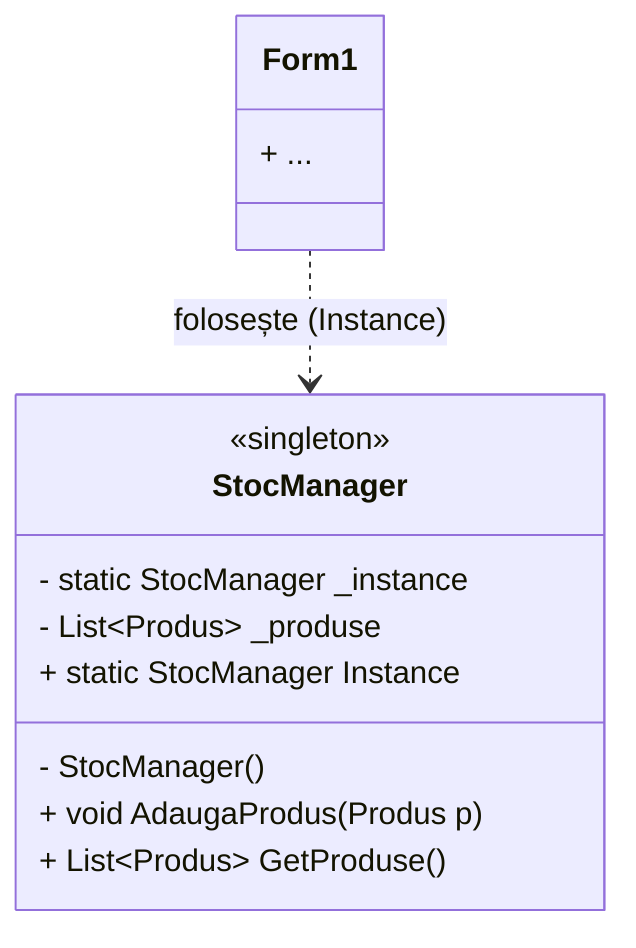
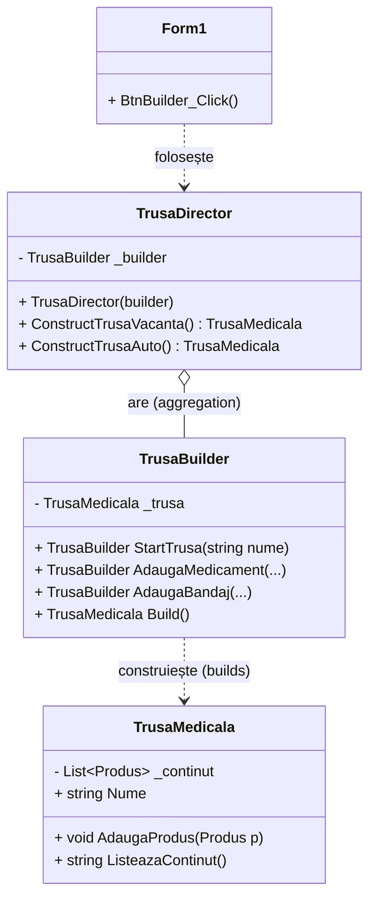
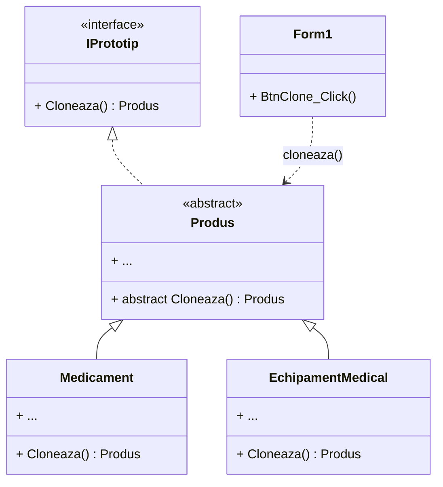

# Laborator 3 - Pattern-uri Creaționale (Diagrame UML)

Aceste diagrame ilustrează structura pattern-urilor implementate: Singleton, Builder și Prototype.

## 1. Singleton Pattern (`StocManager`)

Clasa `StocManager` asigură un singur punct de acces la inventarul de produse din întreaga aplicație.

## 2. Builder Pattern (`TrusaBuilder`)

Separă construcția obiectului complex [TrusaMedicala](file:///c:/Users/John/Desktop/TMPPP/Farmacie_SOLID_UTM/Farmacie_SOLID_UTM/Models/TrusaMedicala.cs#9-40) de reprezentarea sa finală, permițând crearea pas-cu-pas.

## 3. Prototype Pattern (`IPrototip`)

Permite clonarea obiectelor [Produs](file:///c:/Users/John/Desktop/TMPPP/Farmacie_SOLID_UTM/Farmacie_SOLID_UTM/Models/TrusaMedicala.cs#14-18) (Medicament, EchipamentMedical) pentru a crea duplicate rapid.

