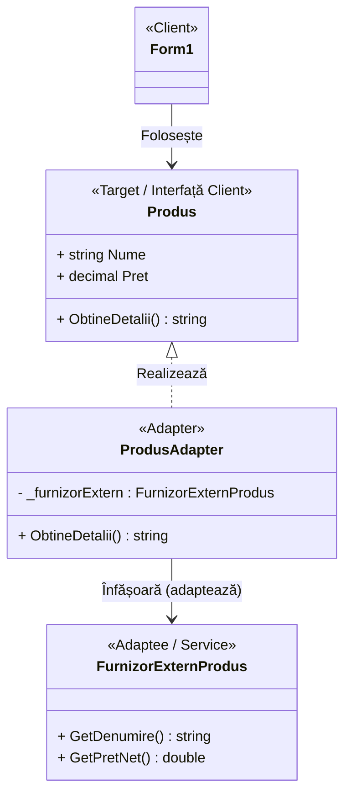
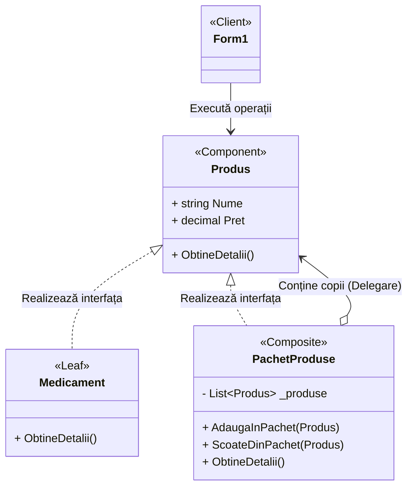
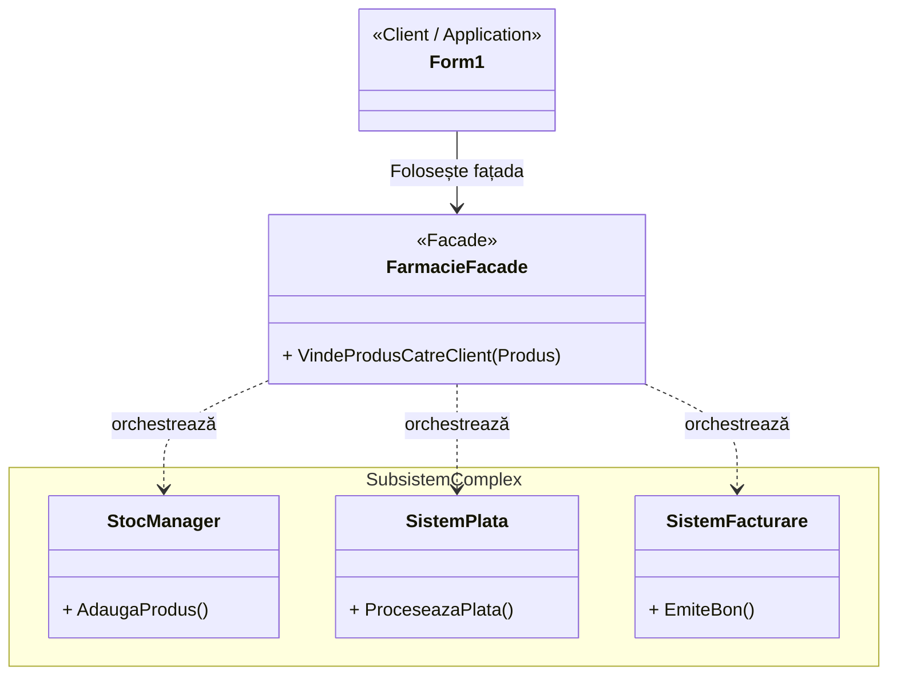

# Ghid Laborator 4: Pattern-uri Structurale

Acest document conține explicațiile necesare pentru prezentarea Laboratorului 4, referitoare la pattern-urile structurale (Adapter, Composite, Façade) implementate în aplicația farmaciei.

---

## 1. Adapter (Adaptorul)

**Definiție:**
Transformă interfața unei clase în altă interfață, așteptată de client. Permite funcționarea împreună a claselor care altfel nu ar putea colabora din cauza interfețelor incompatibile.

**Explicat simplu (pe scurt):**
Funcționează ca un traducător: face ca două clase complet diferite să poată lucra împreună prin intermediul unui "adaptor".

**Ce problemă rezolvă?**
Dacă avem un produs de la un furnizor care are funcții diferite față de ale noastre, Adaptorul le "traduce". Astfel, noi nu trebuie să modificăm codul nostru de bază din farmacie.

**Cod scurt:**
```csharp
// Clasa străină (pe care nu o putem modifica)
public class FurnizorExternProdus {
    public string GetDenumire() { return "Aspirina Importată"; }
    public double GetPretNet() { return 45.50; }
}

// Adaptorul nostru
public class ProdusAdapter : Produs {
    private FurnizorExternProdus _extern;

    public ProdusAdapter(FurnizorExternProdus externObj) 
        : base(externObj.GetDenumire(), (decimal)externObj.GetPretNet()) {
        _extern = externObj;
    }

    public override string ObtineDetalii() {
        return $"[Adaptat] {_extern.GetDenumire()}";
    }
}
```

**Explicația codului:**
Avem o clasă străină [FurnizorExternProdus](file:///c:/Users/John/Desktop/Anul%20III,%20sem.%20II/TMPPP/TMPPP/Farmacie_SOLID_UTM/Farmacie_SOLID_UTM/Models/FurnizorExternProdus.cs#6-23). Clasa noastră [ProdusAdapter](file:///c:/Users/John/Desktop/Anul%20III,%20sem.%20II/TMPPP/TMPPP/Farmacie_SOLID_UTM/Farmacie_SOLID_UTM/Models/ProdusAdapter.cs#10-15) ascunde acest furnizor în interiorul ei. Programul vede doar un [Produs](file:///c:/Users/John/Desktop/Anul%20III,%20sem.%20II/TMPPP/TMPPP/Farmacie_SOLID_UTM/Farmacie_SOLID_UTM/Models/Produs.cs#16-21) normal, dar Adaptorul preia datele reale din funcțiile străine.

**Diagrama UML:**


**Explicație diagramă:**
[ProdusAdapter](file:///c:/Users/John/Desktop/Anul%20III,%20sem.%20II/TMPPP/TMPPP/Farmacie_SOLID_UTM/Farmacie_SOLID_UTM/Models/ProdusAdapter.cs#10-15) realizează (implementează) interfața vizibilă [Produs](file:///c:/Users/John/Desktop/Anul%20III,%20sem.%20II/TMPPP/TMPPP/Farmacie_SOLID_UTM/Farmacie_SOLID_UTM/Models/Produs.cs#16-21). Din această cauză, el poate intra în sistemul nostru. Săgeata normală (`-->`) arată că Adaptorul ține în el clasa străină [FurnizorExternProdus](file:///c:/Users/John/Desktop/Anul%20III,%20sem.%20II/TMPPP/TMPPP/Farmacie_SOLID_UTM/Farmacie_SOLID_UTM/Models/FurnizorExternProdus.cs#6-23) pentru a o folosi.

---

## 2. Composite (Compozitul)

**Definiție:**
Grupează obiectele în structuri arborescente pentru a reprezenta ierarhii de tip "parte-întreg". Permite clienților să trateze obiectele individuale și compozițiile de obiecte în mod complet uniform.

**Explicat simplu (pe scurt):**
Ne permite să punem obiectele într-o structură de tip copac (obiecte în obiecte) și să ne purtăm cu ambele feluri fix la fel.

**Ce problemă rezolvă?**
Ne ajută să tratăm un singur produs și un pachet întreg fix la fel. De exemplu, prețul unui produs e direct prețul lui. Prețul pachetului e suma din tot ce se află înăuntru. Clientul nu vede diferența, doar cere prețul.

**Cod scurt:**
```csharp
public class PachetProduse : Produs {
    private List<Produs> _produse = new List<Produs>();

    public PachetProduse(string nume) : base(nume, 0) { }

    // Prețul pachetului e calculat ca suma componentelor subordonate
    public new decimal Pret {
        get { return _produse.Sum(p => p.Pret); }
    }

    public void AdaugaInPachet(Produs produs) {
        _produse.Add(produs);
    }
    
    public override string ObtineDetalii() {
        // ... parcurge _produse și printează detalii
    }
}
```

**Explicația codului:**
[PachetProduse](file:///c:/Users/John/Desktop/Anul%20III,%20sem.%20II/TMPPP/TMPPP/Farmacie_SOLID_UTM/Farmacie_SOLID_UTM/Models/PachetProduse.cs#8-54) este de fapt tratat ca un Produs. Dar în spate el ține o listă cu alte Produse. Când îi ceri prețul, el face singur suma tuturor. Din afară, aplicația vinde Pachetul exact cum vinde o simplă pastilă.

**Diagrama UML:**


**Explicație diagramă:**
Clasa `Medicament` și clasa [PachetProduse](file:///c:/Users/John/Desktop/Anul%20III,%20sem.%20II/TMPPP/TMPPP/Farmacie_SOLID_UTM/Farmacie_SOLID_UTM/Models/PachetProduse.cs#8-54) realizează (implementează) baza [Produs](file:///c:/Users/John/Desktop/Anul%20III,%20sem.%20II/TMPPP/TMPPP/Farmacie_SOLID_UTM/Farmacie_SOLID_UTM/Models/Produs.cs#16-21). Astfel, ambele împart același comportament spre aplicație, linia punctată `<|..` arătând relația de realizare a contractului de Produs. Săgeata cu romb gol (`o-->`) arată o formă de agregare - Pachetul conține unul sau mai multe Produse în listă (pot fi alte medicamente sau chiar amestecate).

---

## 3. Façade (Fațada)

**Definiție:**
Oferă o interfață unificată pentru un set de interfețe dintr-un subsistem mai mare. Definește o interfață de nivel înalt care face tot acel subsistem mult mai ușor de utilizat și configurat.

**Explicat simplu (pe scurt):**
Oferă o singură comandă simplă către un mecanism complicat din spate, ascunzând de client tot restul de cod greu.

**Ce problemă rezolvă?**
Pentru a vinde un produs ai nevoie de 3 pași: scazi din stoc, iei banii, dai bonul. Ca să nu scrii aceste 3 comenzi de fiecare dată pe fiecare buton din Form, creezi o "Fațadă". Ea are o singură metodă simplă care le face automat pe toate cele 3 în spate.

**Cod scurt:**
```csharp
// Fațada Simplă
public class FarmacieFacade {
    private StocManager _stoc;
    private SistemPlata _plati;
    private SistemFacturare _facturare;

    public FarmacieFacade() {
        _stoc = StocManager.Instance;
        _plati = new SistemPlata();
        _facturare = new SistemFacturare();
    }

    // Unica modalitate folosită de Client
    public string VindeProdusCatreClient(Produs produs) {
        _stoc.AdaugaProdus(produs); // scadem/afisam in stoc
        if (_plati.ProceseazaPlata(produs.Pret)) {
            _facturare.EmiteBon(produs.Nume, produs.Pret);
            return "Succes";
        }
        return "Eroare plată";
    }
}
```

**Explicația codului:**
Clasa [FarmacieFacade](file:///c:/Users/John/Desktop/Anul%20III,%20sem.%20II/TMPPP/TMPPP/Farmacie_SOLID_UTM/Farmacie_SOLID_UTM/Services/FarmacieFacade.cs#7-43) știe cum funcționează Stocul, Plata și Facturarea. Clientul apelează doar simpla metodă [VindeProdusCatreClient](file:///c:/Users/John/Desktop/Anul%20III,%20sem.%20II/TMPPP/TMPPP/Farmacie_SOLID_UTM/Farmacie_SOLID_UTM/Services/FarmacieFacade.cs#21-42). El nu trebuie să știe cum merg sistemele din interior. Fațada rezolvă tot greul.

**Diagrama UML:**


**Explicație diagramă:**
Clientul (Formularul) lucrează doar cu [FarmacieFacade](file:///c:/Users/John/Desktop/Anul%20III,%20sem.%20II/TMPPP/TMPPP/Farmacie_SOLID_UTM/Farmacie_SOLID_UTM/Services/FarmacieFacade.cs#7-43). Formularul nu atinge celelalte baze de date (Stoc, Plata, Emitere bon). Fațada are linii întrerupte (`..>`) care duc spre acele subsisteme interioare, arătând dependența Fațadei de componentele mici pe care le dirijează.

---

## 4. Testare Unitară (Cum au fost testate)

Iată cum am testat dacă pattern-urile funcționează corect, folosind o abordare simplă și directă:

1. **Test Adapter:**
   Am creat un [FurnizorExternProdus](file:///c:/Users/John/Desktop/Anul%20III,%20sem.%20II/TMPPP/TMPPP/Farmacie_SOLID_UTM/Farmacie_SOLID_UTM/Models/FurnizorExternProdus.cs#6-23) (care are nume străine pentru preț și produs) și l-am pus în [ProdusAdapter](file:///c:/Users/John/Desktop/Anul%20III,%20sem.%20II/TMPPP/TMPPP/Farmacie_SOLID_UTM/Farmacie_SOLID_UTM/Models/ProdusAdapter.cs#10-15). Apoi, am verificat simplu dacă `adapter.Nume` returnează corect "Produs Extern (Importat)" și dacă prețul citit prin adaptor a devenit exact `45.50 MDL`.

2. **Test Composite:**
   Am creat un [PachetProduse](file:///c:/Users/John/Desktop/Anul%20III,%20sem.%20II/TMPPP/TMPPP/Farmacie_SOLID_UTM/Farmacie_SOLID_UTM/Models/PachetProduse.cs#8-54). Am pus în el un `Medicament` care costă 20 MDL și un [BandajElastic](file:///c:/Users/John/Desktop/Anul%20III,%20sem.%20II/TMPPP/TMPPP/Farmacie_SOLID_UTM/Farmacie_SOLID_UTM/Models/BandajElastic.cs#6-10) (care default costă 25 MDL). La final, am verificat dacă `pachet.Pret` știe singur să le adune și returnează corect suma de `45 MDL`.

3. **Test Facade:**
   Am creat o instanță de [FarmacieFacade](file:///c:/Users/John/Desktop/Anul%20III,%20sem.%20II/TMPPP/TMPPP/Farmacie_SOLID_UTM/Farmacie_SOLID_UTM/Services/FarmacieFacade.cs#7-43) și am apelat direct unica ei metodă [VindeProdusCatreClient()](file:///c:/Users/John/Desktop/Anul%20III,%20sem.%20II/TMPPP/TMPPP/Farmacie_SOLID_UTM/Farmacie_SOLID_UTM/Services/FarmacieFacade.cs#21-42). La final, am verificat dacă mesajul pe care mi-l returnează conține cuvântul "Succes", semn că toate cele 3 subsisteme ascunse (Stoc, Plata, Facturare) au funcționat perfect.
