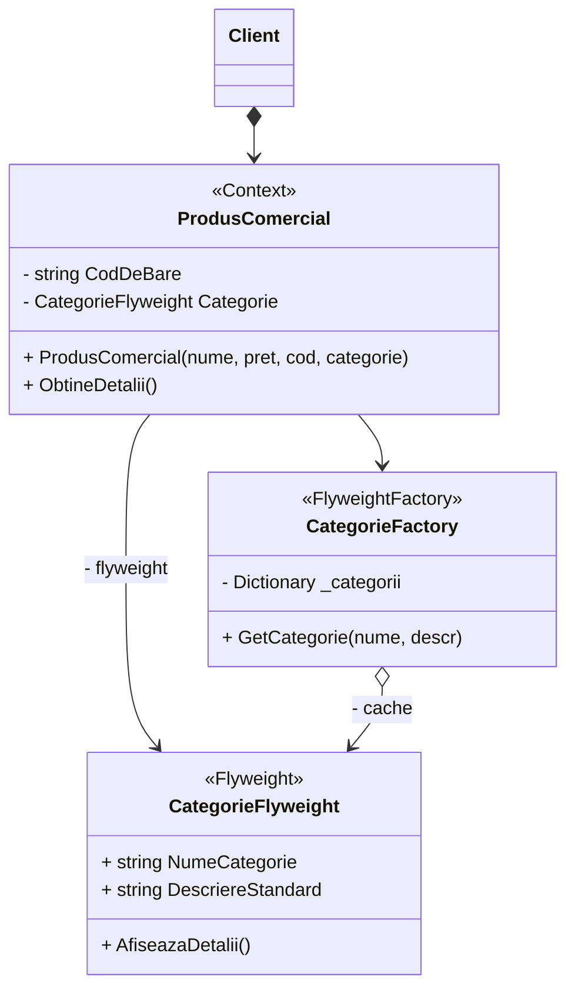
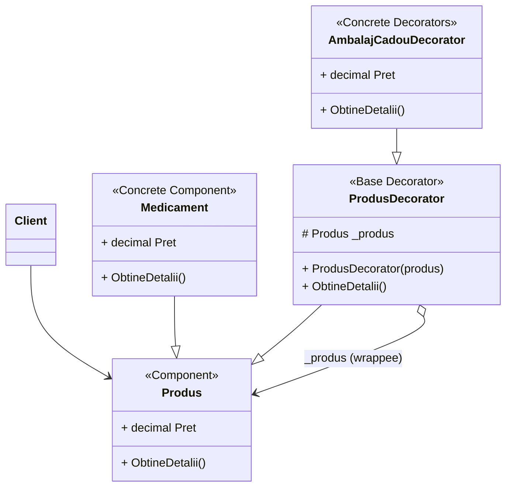
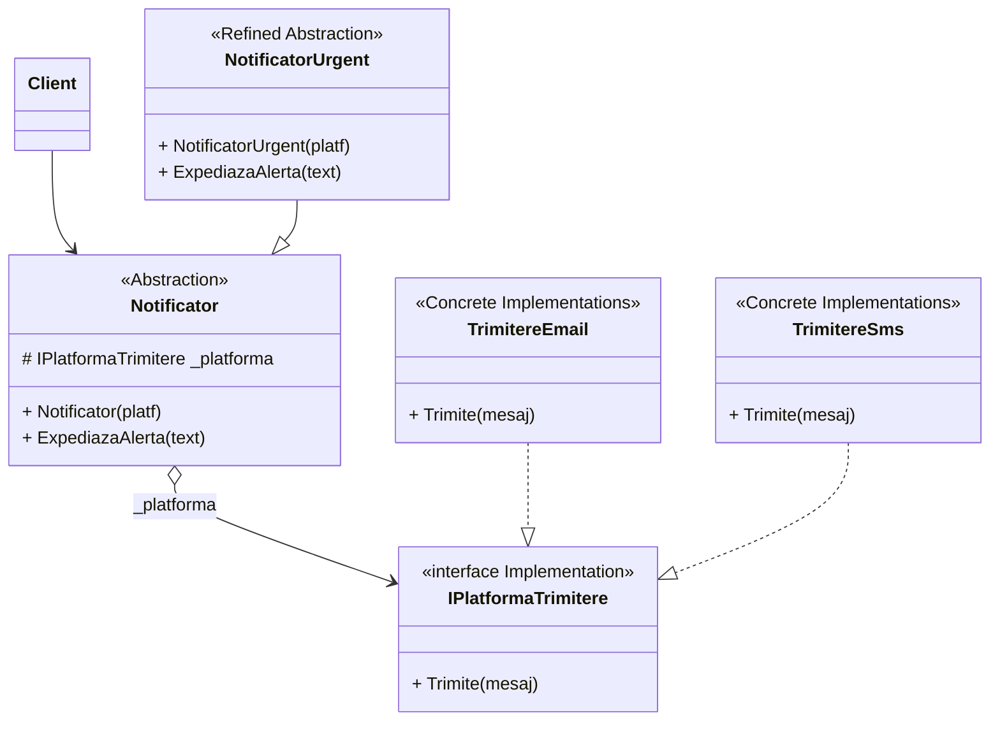
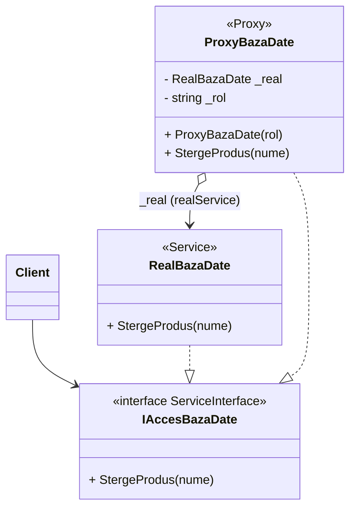

# Ghid Laborator 5: Pattern-uri Structurale (Partea 2)

Acest document conține explicațiile pentru prezentarea Laboratorului 5 (Flyweight, Decorator, Bridge, Proxy).

---

## 1. Flyweight (Musca / Partajarea Memoriei)

**Definiție Oficială:**
Permite suportarea unui număr mult mai mare de obiecte în memoria RAM disponibilă, prin partajarea părților comune de stare între multiple obiecte, în loc să păstrezi absolut toate datele în fiecare obiect individual.

**Explicat simplu (pe scurt):**
Salvează enorm memoria (RAM). Când creezi mii de copii identice de obiecte, extragi setările lor grele la comun într-un singur loc, și trimiți doar referința spre ele.

**Ce problemă rezolvă?**
La general: Salvează memoria RAM împărțind datele comune la mai multe obiecte, în loc ca fiecare să le păstreze separat.
*În aplicația mea:* Salvează memoria păstrând descrierea categoriei o singură dată; mii de medicamente folosesc această descriere comună.

**Cod scurt:**
```csharp
// Obiectul partajat (Flyweight)
public class CategorieFlyweight {
    public string NumeCategorie { get; private set; }
    public string DescriereStandard { get; private set; }
    // constructor...
}

// Fabrica ce se asigură că refolosim mereu aceleași categorii limitate
public class CategorieFactory {
    private Dictionary<string, CategorieFlyweight> _categorii = new Dictionary<string, CategorieFlyweight>();

    public CategorieFlyweight GetCategorie(string nume, string descr) {
        if (!_categorii.ContainsKey(nume))
            _categorii[nume] = new CategorieFlyweight(nume, descr); // Creata o data
        return _categorii[nume]; // Apoi doar refolosita
    }
}

// Produsul care folosește memoria partajată
public class ProdusComercial : Produs {
    public string CodDeBare { get; private set; }
    public CategorieFlyweight Categorie { get; private set; } // Referință
}
```

**Explicația codului:**
Când instanțiem un produs nou, apelăm clasa [CategorieFactory](file:///c:/Users/John/Desktop/Anul%20III,%20sem.%20II/TMPPP/TMPPP/Farmacie_SOLID_UTM/Farmacie_SOLID_UTM/Models/CategorieFactory.cs#6-24). Aceasta verifică dacă respectiva categorie există deja în dicționar. O creează doar la prima cerere; ulterior, returnează mereu aceeași instanță pentru toate produsele următoare, optimizând astfel consumul de memorie.

**Diagrama UML:**


**Explicație diagramă:**
Clasa [CategorieFactory](file:///c:/Users/John/Desktop/Anul%20III,%20sem.%20II/TMPPP/TMPPP/Farmacie_SOLID_UTM/Farmacie_SOLID_UTM/Models/CategorieFactory.cs#6-24) funcționează ca un dicționar pentru instanțele unice de tipul [CategorieFlyweight](file:///c:/Users/John/Desktop/Anul%20III,%20sem.%20II/TMPPP/TMPPP/Farmacie_SOLID_UTM/Farmacie_SOLID_UTM/Models/CategorieFlyweight.cs#12-17) (evidențiat prin relația `o-->` cache). Clasa de context, [ProdusComercial](file:///c:/Users/John/Desktop/Anul%20III,%20sem.%20II/TMPPP/TMPPP/Farmacie_SOLID_UTM/Farmacie_SOLID_UTM/Models/ProdusComercial.cs#13-19), menține doar o simplă referință către obiectul Flyweight partajat, în loc să dubleze atributele acestuia intern în fiecare produs.

---

## 2. Decorator (Decoratorul)

**Definiție Oficială:**
Permite atașarea de noi comportamente la obiecte, plasându-le în interiorul unor obiecte "înveliș" (wrapper) speciale care conțin strict comportamentele noi.

**Explicat simplu (pe scurt):**
"Îmbracă" un obiect vechi într-un strat de cod extra. E ca o "Matrioșka" (păpușă rusească): prima păpușă e originalul, celelalte formează extra-comportamentul strâns deasupra ei.

**Ce problemă rezolvă?**
La general: Te ferește de crearea manuală a sutelor de subclase noi atunci când adaugi opțiuni extra unui obiect.
*În aplicația mea:* Am adăugat "Ambalajul Cadou" direct pe medicament, fără să creez inutil clasa separată `MedicamentCuAmbalaj`.

**Cod scurt:**
```csharp
// Decoratorul de bază
public abstract class ProdusDecorator : Produs {
    protected Produs _produs;
    public ProdusDecorator(Produs produs) : base("", 0) { _produs = produs; }
    public override string ObtineDetalii() => _produs.ObtineDetalii();
}

// Decorator Concret (extensia nouă impusă direct la rulare)
public class AmbalajCadouDecorator : ProdusDecorator {
    public AmbalajCadouDecorator(Produs produs) : base(produs) { }

    public new decimal Pret { get { return _produs.Pret + 5.0m; } } // SupraCrie si extinde
    public override string ObtineDetalii() {
        return base.ObtineDetalii() + " [+Ambalaj Cadou]";
    }
}
```

**Explicația codului:**
Clasa abstractă de bază [ProdusDecorator](file:///c:/Users/John/Desktop/Anul%20III,%20sem.%20II/TMPPP/TMPPP/Farmacie_SOLID_UTM/Farmacie_SOLID_UTM/Decorators/ProdusDecorator.cs#6-21) încapsulează un obiect de tip [Produs](file:///c:/Users/John/Desktop/Anul%20III,%20sem.%20II/TMPPP/TMPPP/Farmacie_SOLID_UTM/Farmacie_SOLID_UTM/Models/Produs.cs#9-28). Subclasa [AmbalajCadouDecorator](file:///c:/Users/John/Desktop/Anul%20III,%20sem.%20II/TMPPP/TMPPP/Farmacie_SOLID_UTM/Farmacie_SOLID_UTM/Decorators/AmbalajCadouDecorator.cs#10-13) extinde funcționalitatea din mers: apelează metoda obiectului original (pentru obținerea detaliilor de bază), la care adaugă propriul comportament impus (o taxă de 5 MDL și un text adițional), păstrând structura originală intactă.

**Diagrama UML:**


**Explicație diagramă:**
Clasa [ProdusDecorator](file:///c:/Users/John/Desktop/Anul%20III,%20sem.%20II/TMPPP/TMPPP/Farmacie_SOLID_UTM/Farmacie_SOLID_UTM/Decorators/ProdusDecorator.cs#6-21) acționează bidimensional: moștenește clasa de bază [Produs](file:///c:/Users/John/Desktop/Anul%20III,%20sem.%20II/TMPPP/TMPPP/Farmacie_SOLID_UTM/Farmacie_SOLID_UTM/Models/Produs.cs#9-28) (`--|>`) pentru a fi compatibilă formal ca tip, și simultan încapsulează o altă instanță de [Produs](file:///c:/Users/John/Desktop/Anul%20III,%20sem.%20II/TMPPP/TMPPP/Farmacie_SOLID_UTM/Farmacie_SOLID_UTM/Models/Produs.cs#9-28) (agregarea `o-->` wrappee). Astfel, dă posibilitatea "împachetării" succesive a obiectelor adăugând straturi de funcționalitate (cum face copilul său [AmbalajCadouDecorator](file:///c:/Users/John/Desktop/Anul%20III,%20sem.%20II/TMPPP/TMPPP/Farmacie_SOLID_UTM/Farmacie_SOLID_UTM/Decorators/AmbalajCadouDecorator.cs#10-13)).

---

## 3. Bridge (Podul)

**Definiție Oficială:**
Împarte o clasă mare (sau un grup de clase prea strâns legate din start) în două ierarhii separate și libere: una logică (Abstractizare) și una tehnică (Implementare), lăsându-le să se dezvolte mereu independent una față de cealaltă.

**Explicat simplu (pe scurt):**
Desparte pur brutal concepția inițială veche. Desparte clasa veche folosind în schimb "compoziția de obiecte" vizuală: pui setările tehnice într-o cutiuță, și cele de text într-o altă cutiuță separată. Iar Podul doar le leagă simplu ca la final de traseu.

**Ce problemă rezolvă?**
La general: Oprește înmulțirea uriașă de clase atunci când o entitate se extinde deodată în două direcții complet diferite.
*În aplicația mea:* Am decuplat *Ce Trimit* (Tipul de Notificare) de *Cum o Trimit* (Platforma SMS/Email). Așa le pot combina oricum doresc din mers, scutindu-mă de clase ca `AlertaUrgentaPrinSms`.

**Cod scurt:**
```csharp
// Implementări pure (CUM facem asta)
public interface IPlatformaTrimitere { void Trimite(string mesaj); }
public class TrimitereEmail : IPlatformaTrimitere { public void Trimite... }
public class TrimitereSms : IPlatformaTrimitere { public void Trimite... }

// Abstractizare separată (CE facem de fapt - clasa vizibilă)
public class Notificator {
    protected IPlatformaTrimitere _platforma; // Podul fizic

    public Notificator(IPlatformaTrimitere platf) { _platforma = platf; } // Injection

    public virtual void ExpediazaAlerta(string text) => _platforma.Trimite(text);
}

// Abstractizare extinsa funcțional - Refinement
public class NotificatorUrgent : Notificator {
    public NotificatorUrgent(IPlatforma platf) : base(platf) {}
    public override void ExpediazaAlerta(string txt) {
        base.ExpediazaAlerta("[URGENT] " + txt);
    }
}
```

**Explicația codului:**
Clasa [NotificatorUrgent](file:///c:/Users/John/Desktop/Anul%20III,%20sem.%20II/TMPPP/TMPPP/Farmacie_SOLID_UTM/Farmacie_SOLID_UTM/Services/NotificatorUrgent.cs#7-20) se concentrează strict pe modificarea detaliilor mesajului logic (adaugă prefixul URGENT). Procesul tehnic de a trimite acel mesaj este delegat în totalitate (`_platforma.Trimite()`) claselor separate aflate sub interfața [IPlatformaTrimitere](file:///c:/Users/John/Desktop/Anul%20III,%20sem.%20II/TMPPP/TMPPP/Farmacie_SOLID_UTM/Farmacie_SOLID_UTM/Interfaces/IPlatformaTrimitere.cs#4-8) (precum [TrimitereSms](file:///c:/Users/John/Desktop/Anul%20III,%20sem.%20II/TMPPP/TMPPP/Farmacie_SOLID_UTM/Farmacie_SOLID_UTM/Services/TrimitereSms.cs#7-14)), evitând astfel programarea "rigidă" direct în aceleași clase.

**Diagrama UML:**


**Explicație diagramă:**
Structura este divizată clar în două ierarhii verticale opuse: Abstractizarea (stânga) și Implementarea tehnică (dreapta). Linia transversală de agregare (`o-->`) dintre clasa [Notificator](file:///c:/Users/John/Desktop/Anul%20III,%20sem.%20II/TMPPP/TMPPP/Farmacie_SOLID_UTM/Farmacie_SOLID_UTM/Services/Notificator.cs#11-16) și interfața [IPlatformaTrimitere](file:///c:/Users/John/Desktop/Anul%20III,%20sem.%20II/TMPPP/TMPPP/Farmacie_SOLID_UTM/Farmacie_SOLID_UTM/Interfaces/IPlatformaTrimitere.cs#4-8) reprezintă "Podul" conceptual care conectează cele două ierarhii doar la momentul asocierii.

---

## 4. Proxy (Procurorul / Intermediarul)

**Definiție Oficială:**
Proxy este un *pattern structural* în care un obiect acționează ca intermediar sau substitut pentru un alt obiect ("Real Object"), controlând complet accesul către acesta.

**Explicat simplu (pe scurt):**
Introducem o clasă intermediară cu aceeași interfață ca obiectul real. Clientul interacționează cu ea crezând că e obiectul original, iar proxy-ul interceptează cererea și decide exact ce să face cu ea.

**Ce problemă rezolvă?**
La general: Problema apare la obiectele „grele” (ex: interogări masive la baza de date) necesare doar ocazional, a căror creare anticipată consumă inutil resurse. Proxy rezolvă asta instanțiind obiectul real doar la nevoie (lazy initialization) și adăugând logică suplimentară (verificări, securitate) fără a modifica clasa originală.
*În aplicația mea:* Protejează Baza de Date la acțiuni critice (ștergerea). Proxy-ul respectă interfața veche, dar execută ștergerea reală doar după ce verifică dacă ai rolul necesar („Manager”).

**Cod scurt:**
```csharp
public interface IAccesBazaDate { void StergeProdus(string nume); }

public class RealBazaDate : IAccesBazaDate {
    public void StergeProdus(string nume) { Console.WriteLine("Șters definitiv in DB"); }
}

// Funcționează ca filtru protector
public class ProxyBazaDate : IAccesBazaDate {
    private RealBazaDate _real;
    private string _rol;
    
    public ProxyBazaDate(string rol) { _rol = rol; }

    public void StergeProdus(string nume) {
        if (_rol == "Manager") {
            _real = new RealBazaDate(); // abia aici o creăm pentru optimizare
            _real.StergeProdus(nume);
        } else {
            Console.WriteLine("Acces interzis! Fără rol capabil.");
        }
    }
}
```

**Explicația codului:**
Clasa [ProxyBazaDate](file:///c:/Users/John/Desktop/Anul%20III,%20sem.%20II/TMPPP/TMPPP/Farmacie_SOLID_UTM/Farmacie_SOLID_UTM/Services/ProxyBazaDate.cs#7-36) interceptează apelul către baza de date reală. În metoda de ștergere, ea evaluează permisiunile din sistem: dacă rolul nu este "Manager", blochează execuția. Doar dacă utilizatorul are drepturi depline, Proxy-ul instanțiază și deleagă comanda către obiectul vulnerabil [RealBazaDate](file:///c:/Users/John/Desktop/Anul%20III,%20sem.%20II/TMPPP/TMPPP/Farmacie_SOLID_UTM/Farmacie_SOLID_UTM/Services/RealBazaDate.cs#7-15).

**Diagrama UML:**


**Explicație diagramă:**
Atât obiectul real cât și Proxy-ul implementează aceeași interfață ([IAccesBazaDate](file:///c:/Users/John/Desktop/Anul%20III,%20sem.%20II/TMPPP/TMPPP/Farmacie_SOLID_UTM/Farmacie_SOLID_UTM/Interfaces/IAccesBazaDate.cs#4-8)). Acest lucru obligă clasa Proxy să arate identic pentru client. Suplimentar, Proxy-ul menține o relație structurală (`o-->` realService) orientată direct spre obiectul real de dedesubt, dictând când sau cum acesta este accesat.

---

## 5. Testarea Unitară pentru cele 4 noi Pattern-uri

Iată și dovada corectitudinii pe scurt (în consola UnitTests):

1. **Flyweight:** A fost simulată crearea a două produse distincte asociate aceleiași categorii ("Antibiotice"). Rezultatul testului (`object.ReferenceEquals`) confirmă că ambele produse partajează aceeași adresă de memorie pentru categorie, dovedind optimizarea instanțierii.
2. **Decorator:** Decoratorul [AmbalajCadouDecorator](file:///c:/Users/John/Desktop/Anul%20III,%20sem.%20II/TMPPP/TMPPP/Farmacie_SOLID_UTM/Farmacie_SOLID_UTM/Decorators/AmbalajCadouDecorator.cs#10-13) a fost aplicat cu succes peste un produs standard. Testul demonstrează că prețul a suferit o adiție dinamică corectă (ex. +5) fără modificarea permanentă a comportamentului produsului intern original.
3. **Bridge:** Conectarea clasei [NotificatorUrgent](file:///c:/Users/John/Desktop/Anul%20III,%20sem.%20II/TMPPP/TMPPP/Farmacie_SOLID_UTM/Farmacie_SOLID_UTM/Services/NotificatorUrgent.cs#7-20) la platforma [TrimitereSms](file:///c:/Users/John/Desktop/Anul%20III,%20sem.%20II/TMPPP/TMPPP/Farmacie_SOLID_UTM/Farmacie_SOLID_UTM/Services/TrimitereSms.cs#7-14) exemplifică succesul abstracției prin compoziție. Metoda finală inserează prefixul de urgență combinându-l cu transmiterea corectă via SMS.
4. **Proxy:** Testul de autorizare ilustrează protejarea clară a integrității datelor. Instanțierea cu un rol fals ("UserSimplu") a fost blocată corect, iar cererea unui profil aprobat ("Manager") a permis derularea ștergerii în deplină siguranță.
