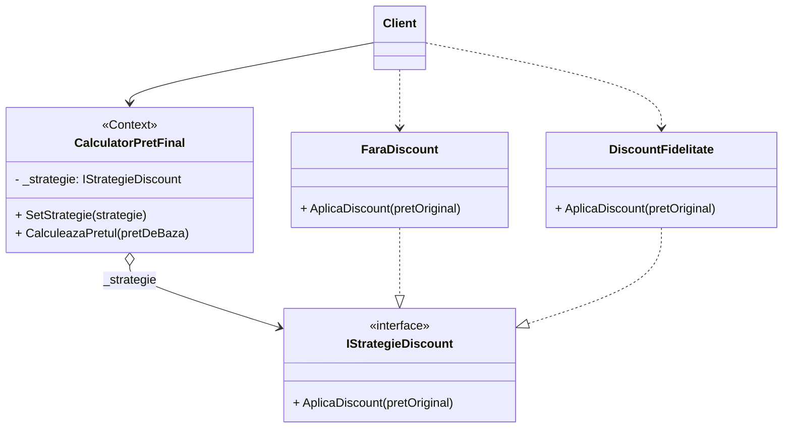
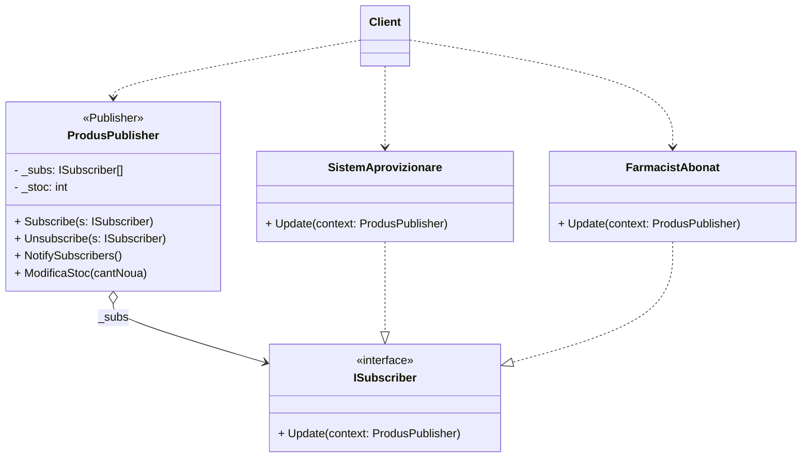
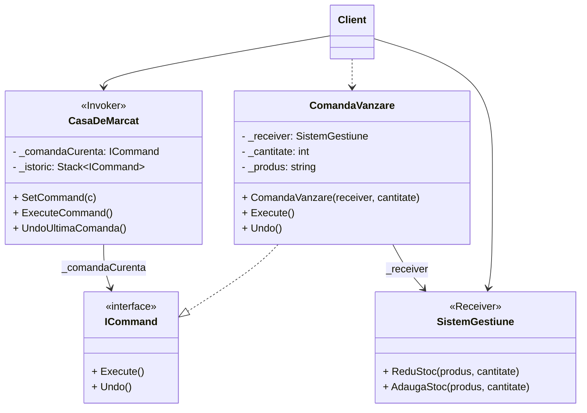
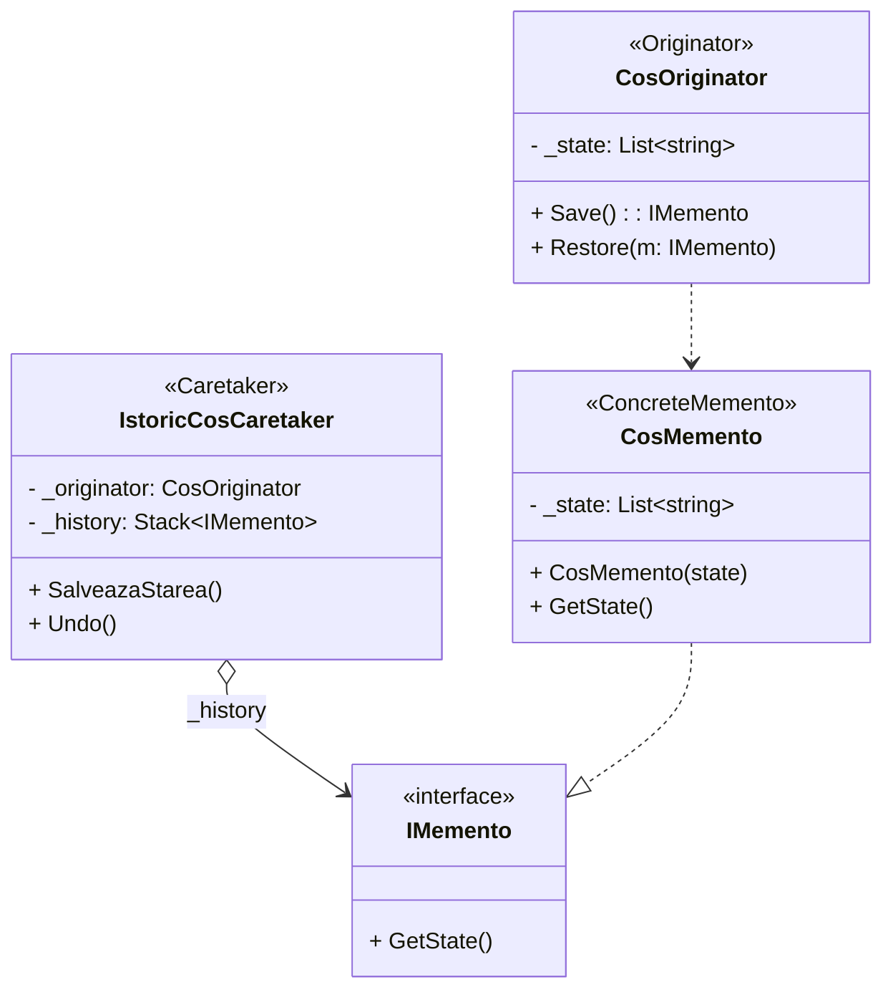
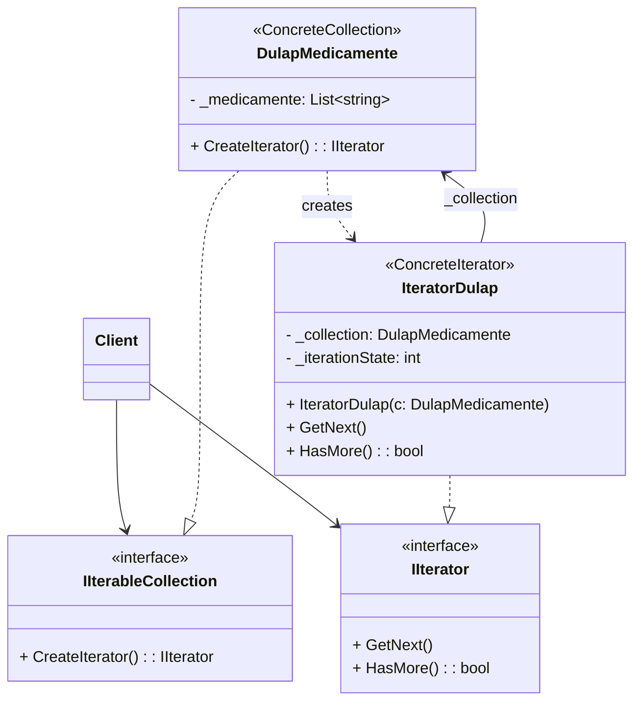

# Ghid Laborator 6: Pattern-uri Comportamentale

Acest document conține explicațiile pentru prezentarea Laboratorului 6 (Strategy, Observer, Command, Memento și Iterator). Aceste pattern-uri gestionează eficient algoritmica și fluxul de date dintre obiectele sistemului nostru.

---

## 1. Strategy (Strategia)

**Definiție Oficială:**
Strategy extrage algoritmii din clasa principală și îi mută în clase separate. Astfel, procedurile de lucru devin interschimbabile la rulare.

**Ce problemă rezolvă?**
* **La general:** Elimină blocurile uriașe de `if/switch` din cod. Fiecare mod de calcul primește o clasă mică și separată.
* **În aplicația mea:** Ascunde matematica complicată din spatele casei de marcat. În loc de `if`-uri repetitive, fiecare mod de a face o reducere (ex. `DiscountFidelitate`) a fost scos de acolo și transformat într-o funcție mică, izolată.

**Cod scurt:**
```csharp
public interface IStrategieDiscount { decimal AplicaDiscount(decimal pretOriginal); }

public class FaraDiscount : IStrategieDiscount { 
    public decimal AplicaDiscount(decimal p) => p; 
}
public class DiscountFidelitate : IStrategieDiscount { 
    public decimal AplicaDiscount(decimal p) => p * 0.90m; 
}

public class CalculatorPretFinal {
    private IStrategieDiscount _strategie;
    public void SetStrategie(IStrategieDiscount strategie) => _strategie = strategie;
    public decimal CalculeazaPretul(decimal pretDeBaza) => _strategie.AplicaDiscount(pretDeBaza);
}
```

**Explicația codului:**
Clasa `CalculatorPretFinal` primește o interfață `IStrategieDiscount` setată extern de `Client`. La calcul, folosește transparent acea metodă injectată, necunoscând complet și neapăsând-o structura de bază (că i-am dat de pensionari sau clienți loiali). Prețul vine rezultant la interfață standard.

**Diagrama UML:**


**Explicație diagramă:**
Contextul (`CalculatorPretFinal`) depinde (`o-->`) exclusiv de interfața `IStrategieDiscount`. Calculatorul doar dă comanda, iar calculul fizic se produce imediat sub ea, în clasa `DiscountFidelitate` aleasă (`..|>`), complet independent de clasa principală.

---

## 2. Observer (Observatorul / Abonatul)

**Definiție Oficială:**
Observer instituie un sistem de abonare, în care un obiect principal trimite notificări automate tuturor fișierelor dependente când a suferit modificări importante.

**Ce problemă rezolvă?**
* **La general:** Sistemul previne verificările manuale ("S-a schimbat ceva?"). Trimite o alertă asincronă exact în clipa evenimentului.
* **În aplicația mea:** Scutește farmaciștii de necesitatea verificării manuale regulate a raftului. Dacă stocul unui produs se apropie de zero, sistemul principal le trimite automat o notificare clară direct angajaților abonați.

**Cod scurt:**
```csharp
public interface ISubscriber { void Update(ProdusPublisher context); }

public class ProdusPublisher {
    private List<ISubscriber> _subs = new List<ISubscriber>();
    private int _stoc;
    
    public void Subscribe(ISubscriber s) => _subs.Add(s);
    public void NotifySubscribers() { 
        foreach(var s in _subs) s.Update(this); 
    }
    
    public void ModificaStoc(int cantNoua) {
        _stoc = cantNoua;
        if(_stoc < 5) NotifySubscribers(); 
    }
}

public class SistemAprovizionare : ISubscriber {
    public void Update(ProdusPublisher context) { 
        Console.WriteLine("Lansam comanda urgenta la furnizori!"); 
    }
}
```

**Explicația codului:**
Colecția abstractă `ISubscriber` deține metoda banală funcțională de `Update`. Când Produsul atinge un numitor sensibil periculos la cantitate, strigă direct bucla de alertare (`NotifySubscribers`), trezind astfel instant acțiuni grele din `SistemAprovizionare` sau informări la angajați, separate de sarcina inițială a clasei Produs.

**Diagrama UML:**


**Explicație diagramă:**
Obiectul-sursă `ProdusPublisher` ține stocată o listă cu interfața `ISubscriber` (`o-->`). În secunda în care stocul scade extrem de mult, metoda va striga universal comanda blindă `Update()` activând alarme la abonați precum `SistemAprovizionare`.

---

## 3. Command (Comanda)

**Definiție Oficială:**
Command transformă o sarcină normală de program într-un obiect cap-coadă. Avantajul major este posibilitatea de a anula (Undo) acea acțiune ulterior dintr-un istoric.

**Ce problemă rezolvă?**
* **La general:** Permite păstrarea comenzilor pe o stivă (listă) pentru a fi analizate sau mai ales anulate treptat (functia Undo).
* **În aplicația mea:** Pregătește o plasă de salvare pentru sistem la nivelul vânzării. Acțiunea de cumpărare devine de fapt comanda stabilă `ComandaVanzare`, care permite sistemului să poată oricând executa un simplu `Undo()` al tranzacției.

**Cod scurt:**
```csharp
public interface ICommand { void Execute(); void Undo(); }

public class ComandaVanzare : ICommand {
    private SistemGestiune _rec;
    private int _cant;
    public ComandaVanzare(SistemGestiune r, int c) { _rec = r; _cant = c; }
    
    public void Execute() => _rec.ReduStoc(_cant);
    public void Undo() => _rec.AdaugaStoc(_cant); // Revocare completa
}

public class CasaDeMarcat {
    public void ExecuteCommand(ICommand cmd) { cmd.Execute(); _istoric.Push(cmd); }
    public void UndoUltimaComanda() { _istoric.Pop().Undo(); }
}
```

**Explicația codului:**
Apelul pur din Receiverul complex (`SistemGestiune`) e blocat într-un corp concret numit `ComandaVanzare`. Casa de marcat are putere pură de a apela `ExecuteCommand()`. La comiterea oricăror dezastre, stiva memorie intrinsecă `Push`/`Pop` extrage ultima mișcare efectuată, iar comanda însăși apasă butonul final invers de remediere prin cod invers `Undo`.

**Diagrama UML:**


**Explicație diagramă:**
Casa propriu-zisă (`CasaDeMarcat`) comunică general vorbind doar prin comutatorul de interfață generic `ICommand` (`-->`). Doar clasa ce aplică strict vânzarea reală, anume `ComandaVanzare` (`..|>`) coboară intenționat să execute reducerea numerelor direct în unitatea separată din spate `SistemGestiune` (`-->`).

---

## 4. Memento (Istoricul / Suvenirul)

**Definiție Oficială:**
Memento salvează intern și invizibil starea anterioară a sistemului tău într-o capsulă stabilă (Instantaneu), cu care poate da Undo restaurând datele închise protejat anterior.

**Ce problemă rezolvă?**
* **La general:** Este esențial preluării ideilor de "Salvare stare fișier" protejând fișierul generat din fața hack-ărilor exterioare de a edita variabila la interior direct. 
* **În aplicația mea:** Acționează vizibil asigurat ca un punct de siguranță al coșului de medicamente masiv. Tragem repede pe dedesubt un instantaneu temporar sigilat numit `CosMemento`, cu care angajatul poate redeschide din arhivă lista originară precedentă dacă au produs greșeli curente de casă cu clientul.

**Cod scurt:**
```csharp
public class CosOriginator {
    private List<string> _state;
    public IMemento Save() => new CosMemento(new List<string>(_state));
    public void Restore(IMemento m) { _state = ((CosMemento)m).GetState(); }

    public interface IMemento {}
    private class CosMemento : IMemento { // Nested class (ascuns)
        private List<string> _state;
        public CosMemento(List<string> s) { _state = s; }
        public List<string> GetState() => _state;
    }
}
```

**Explicația codului:**
`CosOriginator` ascunde mascat propria clasă sigilată tehnic `CosMemento` invizibilă privată din exterior. Când e apelat de programul extern pe metoda curată `Save()`, tranzitul se face via o interfață complet oarbă și opacă `IMemento`. Apoi la rândul ei decripatată în siguranță la `Restore()`. Memoria este astfel izolată.

**Diagrama UML:**

**Explicație diagramă:**
Istoricul memoriilor adunate (`IstoricCosCaretaker`) lucrează (`o-->`) exclusiv citind masca securizată `IMemento`, el neputând pătrunde prin conținut invaziv periculos. Doar autorul direct de obiect, adică realul `CosOriginator`, are control fizic să genereze sau redea o "copie de memorie" asamblată natural prin `CosMemento` (`..>`).

---

## 5. Iterator (Iteratorul)

**Definiție Oficială:**
Iterator ascunde logica matematică a structurilor de baze largi adiacente listelor, permițându-i programatorului vizitarea datelor foarte repetitiv și sigur element-cu-element din acel fișier.

**Ce problemă rezolvă?**
* **La general:** Previne ca sistemul Clientului să vadă și manipuleze forma completă a unei matrici sau arbore greoi doar trecând linear folosind apel constant specializat.
* **În aplicația mea:** Ascunde lista complicată și ramificată formată ascuns în depozitul `DulapMedicamente`. Extrăgând sarcina de sortare într-o componentă separată liniară, operatorii farmaciei reușesc rapid să verifice medicament cu medicament doar folosind butonul fix `.GetNext()`.

**Cod scurt:**
```csharp
public interface IIterator { object GetNext(); bool HasMore(); }
public interface IIterableCollection { IIterator CreateIterator(); }

public class DulapMedicamente : IIterableCollection {
    public List<string> Items = new List<string>();
    public IIterator CreateIterator() => new IteratorDulap(this);
}

public class IteratorDulap : IIterator {
    private DulapMedicamente _col;
    private int _idx = 0;
    public IteratorDulap(DulapMedicamente c) { _col = c; }
    
    public object GetNext() => _col.Items[_idx++];
    public bool HasMore() => _idx < _col.Items.Count;
}
```

**Explicația codului:**
Păstrăm logică comună. Dulapul e cel obligat forțat la interfață să producă scursorul special `CreateIterator()`. Acel obiect iterator primește pointer real la matrice, folosind algoritmul tehnic specific intern doar lui prin uneltele standardizate abstracte (`HasMore`, `GetNext`). Nici clientul nici dulapul nu-și polueză clasele.

**Diagrama UML:**


**Explicație diagramă:**
Angajatul comunică exclusiv prin asistentul curat de interfețe generice `IIterableCollection` și `IIterator` (`-->`). Astfel, dulapul special real `DulapMedicamente` instanțiază concret (`..>`) în seama noului robot numit `IteratorDulap`, același senzor care folosește independent referențierea cu pointer direct (`-->`) verificând strict numărul viitor real de citit.
