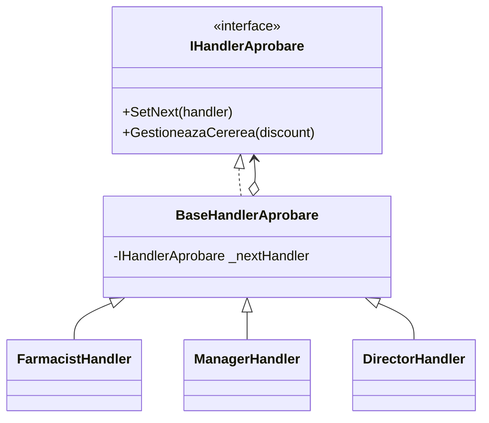
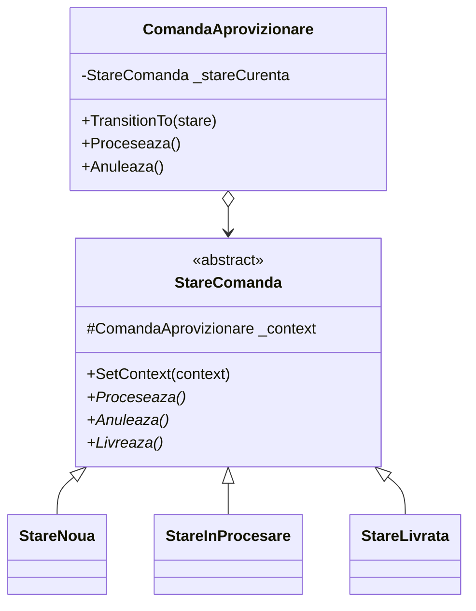
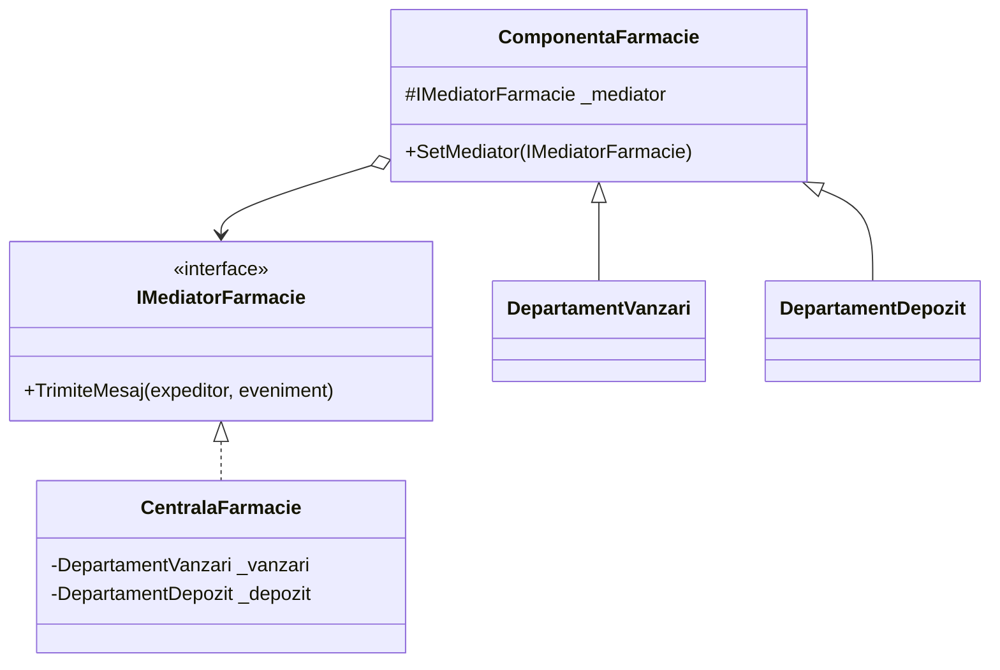
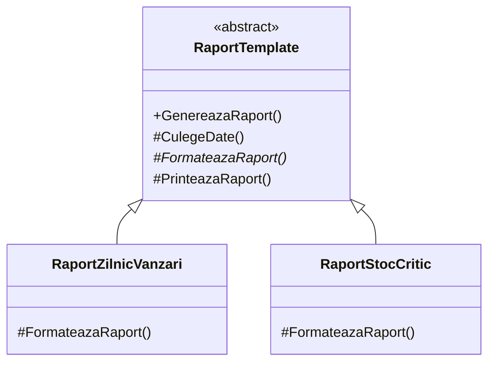
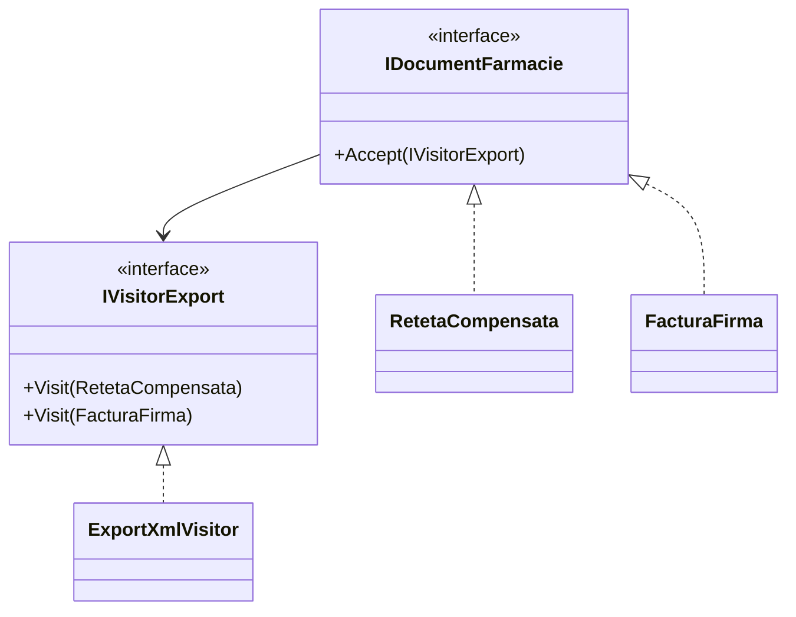

# Laborator 7 - Design Patterns Comportamentale (Partea 2)

Acest document descrie implementarea teoretică și practică a celor 5 patternuri comportamentale finale: **Chain of Responsibility, State, Mediator, Template Method** și **Visitor** în aplicația `Farmacie_SOLID_UTM`.

---

## 1. Chain of Responsibility (Lanțul de Responsabilitate)

**Definiție:** 
Permite transmiterea unei cereri de-a lungul unui lanț de handleri (manipulatori). La primirea cererii, fiecare handler decide fie să o proceseze, fie să o trimită mai departe la următorul handler din lanț.

**Ce problemă rezolvă?**
* **La general:** Elimină blocajele prin care un singur manager central este forțat să cunoască direct toți posibilii receptori ai unei cereri. Dacă un obiect nu poate, trimite sarcina mai departe.
* **În aplicația mea:** Automatizează aprobarea de discount-uri mari.
* **Exemplu clar:** Un client cere 20% discount. Farmacistul apasă pe buton, dar el are limita de 5%, așa că sistemul trimite automat cererea la Manager (care poate 15%). Managerul nici el nu poate, așa că trimite mai departe la Director. Directorul aprobă cererea (căci el n-are limite), totul din culise, fără ca farmacistul să trebuiască să îi contacteze manual.

**Cod scurt:**
```csharp
var farmacist = new FarmacistHandler();
var manager = new ManagerHandler();
var director = new DirectorHandler();

// Construirea lanțului de autoritate
farmacist.SetNext(manager).SetNext(director);

// Testarea cererii (ex. un discount de 12%)
farmacist.GestioneazaCererea(12); // Cade în autoritatea Managerului
```

**Explicație Cod:** 
Fiecare "Handler" decide intern dacă are nivelul de autoritate să aprobe discountul. Deoarece am pus 12%, `FarmacistHandler` (care suportă doar 5%) se recunoaște învins și aplică funcția `base.GestioneazaCererea` dând comanda mai departe pe țeavă către Manager, care are limită 15% și o aprobă.

**Diagramă UML:**


**Explicație diagramă:**
Interfața `IHandlerAprobare` este folosită ca bază stabilă generală. `BaseHandlerAprobare` reține adresa către următorul superior prin săgeata de agregare (`o-->`). Indiferent de cine este apelat concret dedesubt (Farmacist, Manager sau Director), dacă ei pică testul procentului, aruncă "pisica" spre acel `_nextHandler`.

---

## 2. State (Starea)

**Definiție:** 
Permite unui obiect să își modifice complet comportamentul atunci când starea sa internă se schimbă. Din exterior, va părea ca și cum obiectul și-a schimbat clasa cu totul.

**Ce problemă rezolvă?**
* **La general:** Elimină structurile gigantice pline de `switch (stare = "noua") ... case "procesare"`. Fiecare "Stare" primește propria ei clasă complet independentă.
* **În aplicația mea:** Gestionează stările prin care trece o comandă de aprovizionare.
* **Exemplu clar:** Când comanda de medicamente este abia creată (starea "Nouă"), dacă apeși pe "Anulare", sistemul îți permite și o închide. Dar dacă cineva i-a schimbat starea în "Livrată", codul din spatele butonului "Anulare" se schimbă complet și, în loc să anuleze comanda, sistemul te blochează și îți dă eroare! Comanda se apără singură în funcție de etapa în care se află.

**Cod scurt:**
```csharp
var comanda = new ComandaAprovizionare(new StareNoua()); // Implicit ia starea: StareNoua

comanda.Proceseaza(); // Logica se transformă: se trece în StareInProcesare
comanda.Livreaza();   // Logica se transformă: se trece în StareLivrata
comanda.Anuleaza();   // EROARE! Clasa `StareLivrata` nu are functionalitate de anulare
```

**Explicație Cod:** 
Contextul `ComandaAprovizionare` funcționează ca o cutie goală care la pornire instanțiază direct `StareNoua`. Când se folosește metoda `comanda.Proceseaza()`, în culise clasa Nouă aplică funcția de tranziție `comanda.TransitionTo(new StareInProcesare())`, trecând mașinăria în faza a doua de comportament independent.

**Diagramă UML:**


**Explicație diagramă:**
Comanda centrală (`ComandaAprovizionare`) delegă (`o-->`) absolut orice decizie de comportament clasei abstracte `StareComanda`. În loc să aibă zeci de reguli proprii, Comanda lasă sub-clasele `StareNoua` sau `StareLivrata` (care au referința `_context` setată prin `SetContext()`) să decidă ele ce tranziții sau restricții vor arunca utilizatorului la fiecare apel. Acesta este fix mecanismul cerut de diagrama standard.

---

## 3. Mediator (Mediatorul)

**Definiție:** 
Reduce dependențele haotice dintre obiecte, forțându-le să colaboreze exclusiv printr-un obiect central (mediator), în loc să comunice direct între ele.

**Ce problemă rezolvă?**
* **La general:** Reduce dependențele haotice de tip "Spaghete" (toți vorbesc cu toți). Obiectele cunosc acum un singur șef central de dirijare.
* **În aplicația mea:** Previne conectarea directă și haotică dintre clasa "DepartamentVanzari" și clasa "DepartamentDepozit".
* **Exemplu clar:** Când "Departamentul de Vânzări" scanează o aspirină la casa de marcat, el nu se duce direct să modifice stocul din "Depozit" (ceea ce ar fi periculos). El pur și simplu strigă un singur lucru către "CentralaFarmacie": *Am vândut ceva!*. Centrala aude, se întoarce singură spre Depozit și îi dă ordinul de scădere a stocului.

**Cod scurt:**
```csharp
var centrala = new CentralaFarmacie();
var vanzari = new DepartamentVanzari();
var depozit = new DepartamentDepozit();

// Adăugăm ambele departamente în același Mediator
centrala.SeteazaVanzari(vanzari);
centrala.SeteazaDepozit(depozit);

// Când o vânzare trage un semnal de viață, Centrala acționează Depozitul din umbră
vanzari.EfectueazaVanzare(); 
```

**Explicație Cod:** 
Departamentele individuale extind clasa `ComponentaFarmacie`, având astfel în ele automat un link intern cu `_mediator`. Când metoda `vanzari.EfectueazaVanzare()` are loc, ea strigă `_mediator.TrimiteMesaj(this, "VanzareNoua")`. Mediatorul verifică dicționarul de mesaje, detectează că Vânzările au trimis, și contactează singur metoda sigură `_depozit.ScadeStoc()`.

**Diagramă UML:**


**Explicație diagramă:**
Sub-departamentele `DepartamentVanzari` și `DepartamentDepozit` se uită obligatoriu (`o-->`) exclusiv în sus doar spre capota de `IMediatorFarmacie`. În acest fel, structurile lor stau izolate complet una de alta. Doar executantul real `CentralaFarmacie` deține referințele săgeților dedesubt pentru a asambla comunicarea la ambele capete.

---

## 4. Template Method (Metoda Șablon)

**Definiție:** 
Definește scheletul unui algoritm direct în clasa de bază, dar permite claselor derivate să suprascrie anumiți pași specifici, fără a strica structura și ordinea generală a algoritmului.

**Ce problemă rezolvă?**
* **La general:** Permite refolosirea codului care se repetă constant la zeci de obiecte similare (adică partea de "start" și "finish" e comună, doar "mijlocul" e unic).
* **În aplicația mea:** Refolosește codul comun la crearea de rapoarte multiple.
* **Exemplu clar:** Avem un raport de vânzări zilnice și un raport de alertă stoc. Ambele trebuie să se conecteze la date și ambele trebuie să iasă la imprimantă la fel. În loc să scriu codul ăsta de două ori, le-am forțat printr-un șablon (`Template`) care respectă ordinea strictă: (1. Ia datele -> 2. Formatează -> 3. Printează). Clasele de rapoarte mai au voie să scrie cod doar la pasul 2 de Formatare (PDF sau CSV), restul îl moștenesc de-a gata.

**Cod scurt:**
```csharp
// Varianta 1 CSV
RaportTemplate raportZilnic = new RaportZilnicVanzari();
raportZilnic.GenereazaRaport(); // Skeleton complet executat

// Varianta 2 PDF (Stoc Critic)
RaportTemplate raportStoc = new RaportStocCritic();
raportStoc.GenereazaRaport();
```

**Explicație Cod:** 
În clasa principală superioară există funcția fixă `GenereazaRaport()`. Ea va executa orbește procedurile în această ordine mereu. Doar că pașii `CulegeDate()` și `PrinteazaRaport()` sunt scriși fizic de la bază. În schimb, pasul de mijloc fiind marcat `abstract void FormateazaRaport()`, codul C# forțează sub-clasa particulară `RaportStocCritic` să ofere completarea de format PDF acolo jos.

**Diagramă UML:**


**Explicație diagramă:**
Diagrama arată clar clasa superioară `RaportTemplate` cu metoda generală principală expusă `GenereazaRaport()` și funcțiile interne de pași `#`. Săgețile de moștenire arată cum clasele inferioare de PDF sau CSV iau gratuit algoritmul gigant deja dezvoltat sus, oferind redefinire strict pentru pasul de `FormateazaRaport()`.

---

## 5. Visitor (Vizitatorul)

**Definiție:** 
Permite separarea algoritmilor de obiectele pe care aceștia operează. Altfel spus, adaugă noi operații pe un set de clase, fără să le modifici codul intern.

**Ce problemă rezolvă?**
* **La general:** Permite crearea a zeci de tipuri de extensii pentru funcționalitate analitică "pe deasupra", prevenind stricarea claselor fondatoare a vechiului proiect.
* **În aplicația mea:** Ajută la exportarea documentelor în formate noi (XML) fără a polua cu sute de linii de cod clasele originale.
* **Exemplu clar:** Am creat clasa complet separată `ExportXmlVisitor`. Când rulez exportul, el se plimbă pe la clasa `FacturaFirma` și pe la clasa `RetetaCompensata`. Rețeta pur și simplu apelează `Accept()` deschizându-i ușa vizitatorului, iar vizitatorul îi smulge politicos datele (nume pacient, diagnostic) și le împachetează el în structura `<Pacient>Vasile</Pacient>`, lăsând fișierul original de rețetă curat.

**Cod scurt:**
```csharp
var doc1 = new RetetaCompensata { NumePacient = "Vasile" };
var doc2 = new FacturaFirma { TotalDePlata = 500 };

// Inspectorul specializat DOAR pe XML
var visitor = new ExportXmlVisitor();

// Așteptăm ca datele să "accepte" citirea și să se lase publicate de el
doc1.Accept(visitor);
doc2.Accept(visitor);
```

**Explicație Cod:** 
Acesta este clasicul sistem "Double Dispatch". Metoda centrală `Accept(visitor)` din `RetetaCompensata` rulează pur și simplu simplul apel `visitor.Visit(this)`. Practic, rețeta se autotrimite inspectorului XML spunând *"Eu sunt o Rețetă, fă-mi tu un format XML dedicat pe tipul meu de date!"*. Astfel, Inspectorul (`ExportXmlVisitor`) ia datele curate și construiește manual nodurile de etichete Xml la el acasă.

**Diagramă UML:**


**Explicație diagramă:**
Partea de jos `IDocumentFarmacie` este zona datelor protejate, care expune obligatoriu portița mică a interfeței lor prin funcția `Accept`. Prin această portiță pătrunde săgeata dependentă (`-->`) a controlerului superior de inspecție abstract `IVisitorExport`. Astfel, `ExportXmlVisitor` se instalează vizitând fiecare copil și creând algoritmi diferiți în funcție de cine l-a "acceptat".

---
*Acest document sintetizează teoretic aplicabilitatea celor mai sofisticate mecanisme de dirijare și control avansat din arhitectura de sisteme solide a Farmaciei noastre.*
