# Diagrame UML PlantUML — FarmSys (toate 22 patternuri)
# Copiaza fiecare bloc pe plantuml.com si apasa Submit

---

## 1. Singleton — StocManager

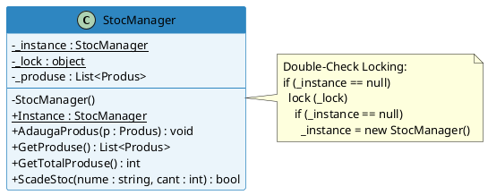

---

## 2. Factory Method — ProdusFactory

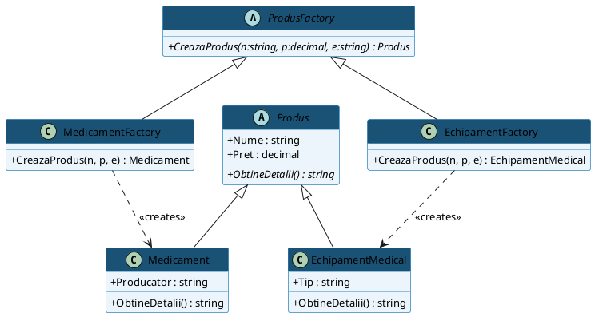

---

## 3. Abstract Factory — ITrusaFactory

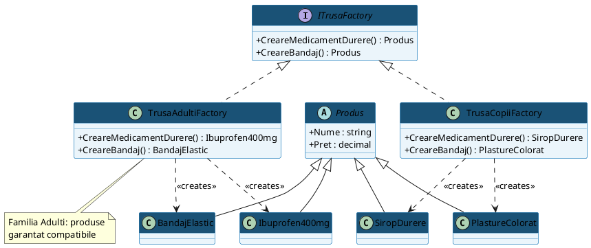

---

## 4. Builder + Director — TrusaBuilder

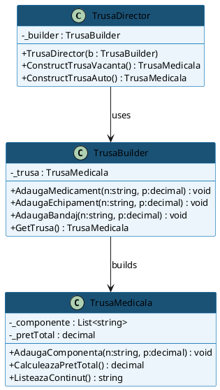

---

## 5. Prototype — Produs.Cloneaza()

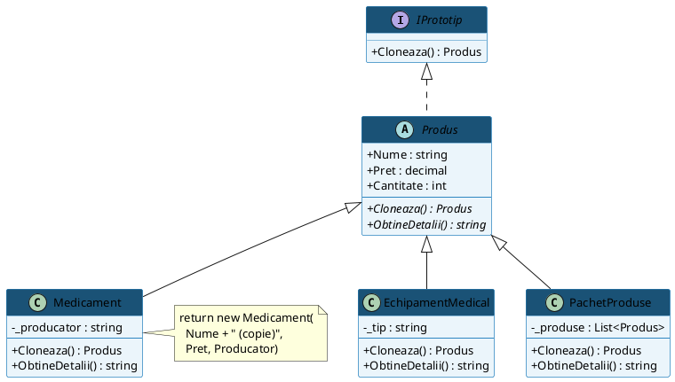

---

## 6. Decorator — AmbalajCadouDecorator

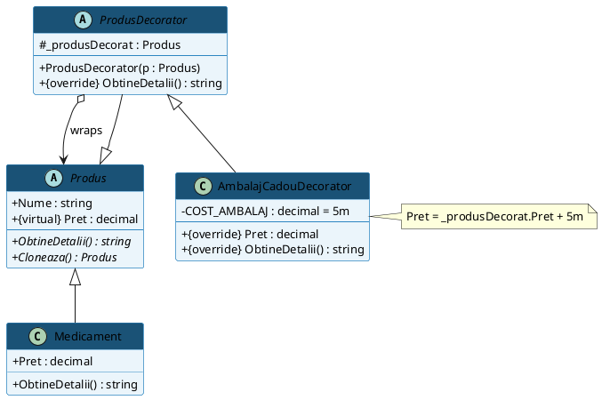

---

## 7. Adapter — ProdusAdapter

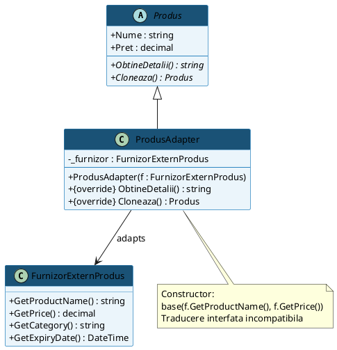

---

## 8. Bridge — Notificator + IPlatformaTrimitere

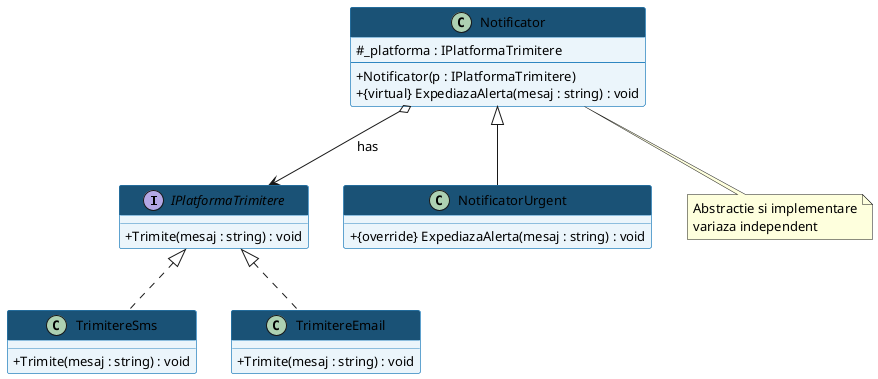

---

## 9. Composite — PachetProduse

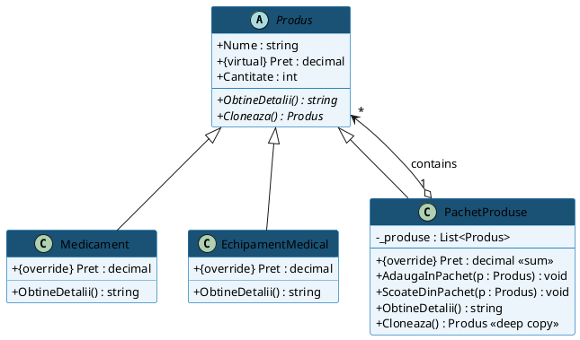

---

## 10. Facade — FarmacieFacade

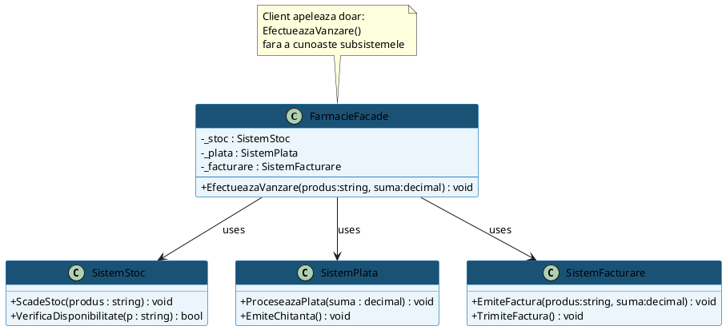

---

## 11. Flyweight — CategorieFactory

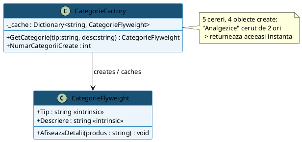

---

## 12. Proxy — ProxyBazaDate

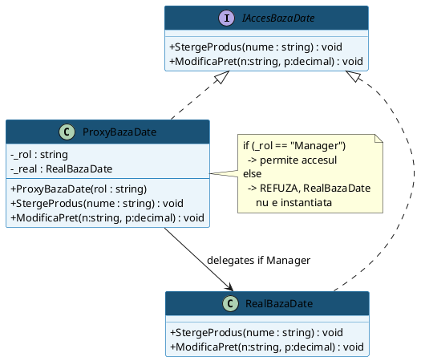

---

## 13. Chain of Responsibility — AprobareDiscount

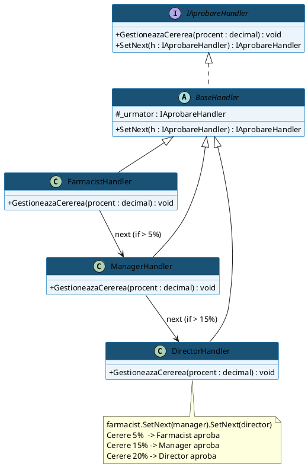

---

## 14. Command — ComandaVanzare

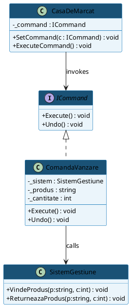

---

## 15. Iterator — DulapMedicamente

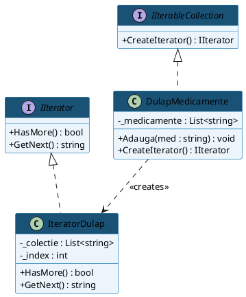

---

## 16. Mediator — CentralaFarmacie

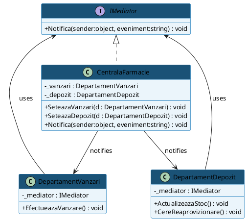

---

## 17. Memento — IstoricCosCaretaker

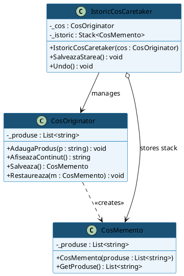

---

## 18. Observer — ProdusPublisher

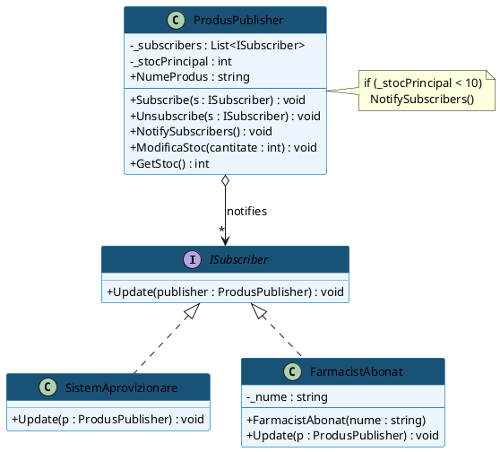

---

## 19. State — ComandaAprovizionare

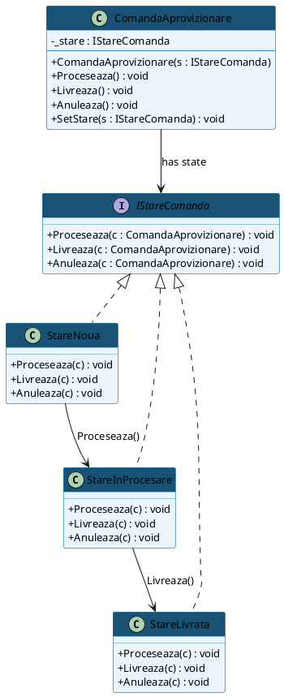

---

## 20. Strategy — CalculatorPretFinal

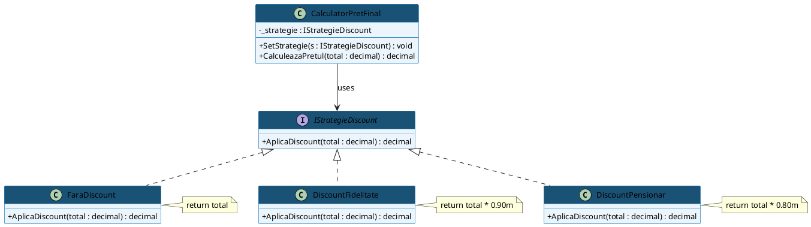

---

## 21. Template Method — RaportTemplate

```plantuml
@startuml TemplateMethod
skinparam classAttributeIconSize 0
skinparam defaultFontName Arial
skinparam defaultFontSize 13
skinparam class {
  BackgroundColor #EBF5FB
  BorderColor #2E86C1
  HeaderBackgroundColor #1A5276
  HeaderFontColor white
}

abstract class RaportTemplate {
  # _continut : string
  --
  + GenereazaRaport() : string <<template>>
  # CulegeDate() : void <<common>>
  # {abstract} FormateazaRaport() : void
  # {abstract} SalveazaFisier() : string
  # PrinteazaRaport(cale : string) : void <<common>>
}

class RaportZilnicVanzari {
  # FormateazaRaport() : void
  # SalveazaFisier() : string
}

class RaportStocCritic {
  # FormateazaRaport() : void
  # SalveazaFisier() : string
}

RaportTemplate <|-- RaportZilnicVanzari
RaportTemplate <|-- RaportStocCritic

note right of RaportTemplate
  GenereazaRaport() {
    CulegeDate()       // fix
    FormateazaRaport() // abstract
    SalveazaFisier()   // abstract
    PrinteazaRaport()  // fix
  }
end note

note bottom of RaportZilnicVanzari : Formateaza CSV\nSalveaza .csv pe Desktop
note bottom of RaportStocCritic : Formateaza TXT\nSalveaza .txt pe Desktop
@enduml
```

---

## 22. Visitor — ExportXmlVisitor

```plantuml
@startuml Visitor
skinparam classAttributeIconSize 0
skinparam defaultFontName Arial
skinparam defaultFontSize 13
skinparam class {
  BackgroundColor #EBF5FB
  BorderColor #2E86C1
  HeaderBackgroundColor #1A5276
  HeaderFontColor white
}

interface IVisitorExport {
  + Visit(r : RetetaCompensata) : void
  + Visit(f : FacturaFirma) : void
}

interface IDocumentFarmacie {
  + Accept(v : IVisitorExport) : void
}

class ExportXmlVisitor {
  - _xml : StringBuilder
  --
  + Visit(r : RetetaCompensata) : void
  + Visit(f : FacturaFirma) : void
  + Salveaza() : (cale, xml)
}

class RetetaCompensata {
  + NumePacient : string
  + Diagnostic : string
  --
  + Accept(v : IVisitorExport) : void
}

class FacturaFirma {
  + NumeFirma : string
  + TotalDePlata : decimal
  --
  + Accept(v : IVisitorExport) : void
}

IVisitorExport <|.. ExportXmlVisitor
IDocumentFarmacie <|.. RetetaCompensata
IDocumentFarmacie <|.. FacturaFirma
ExportXmlVisitor ..> RetetaCompensata : visits
ExportXmlVisitor ..> FacturaFirma : visits

note bottom of RetetaCompensata
  Accept(v) {
    v.Visit(this) // Double Dispatch
  }
end note
@enduml
```
