# Diagrame UML — structura refactoring.guru
# Copiaza fiecare bloc pe plantuml.com -> Submit

---

## 1. Singleton

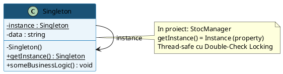

---

## 2. Factory Method

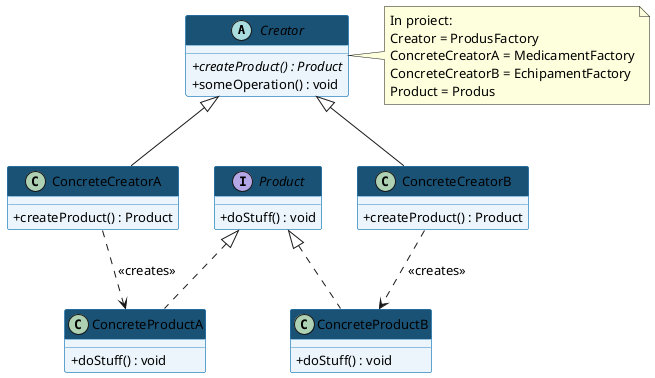

---

## 3. Abstract Factory

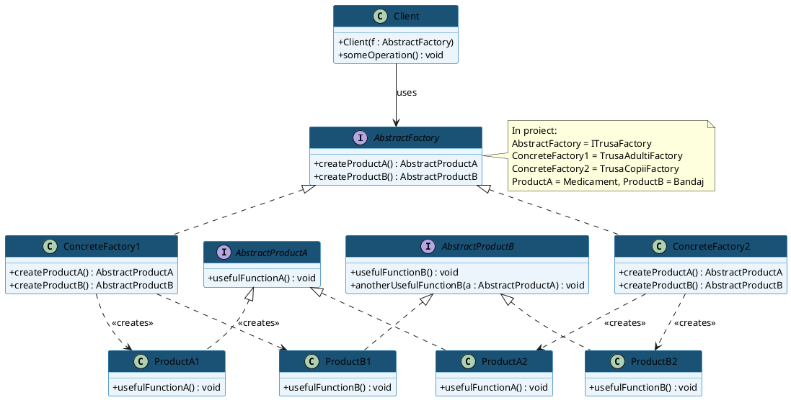

---

## 4. Builder

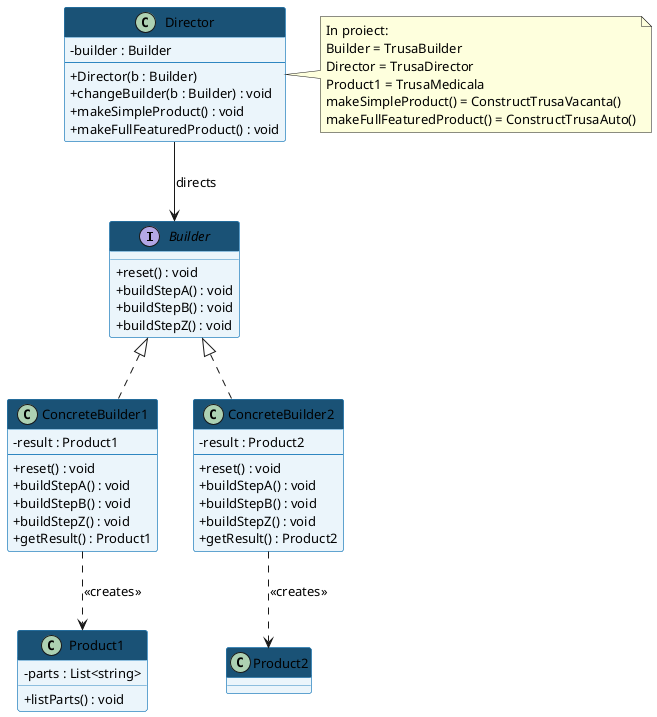

---

## 5. Prototype

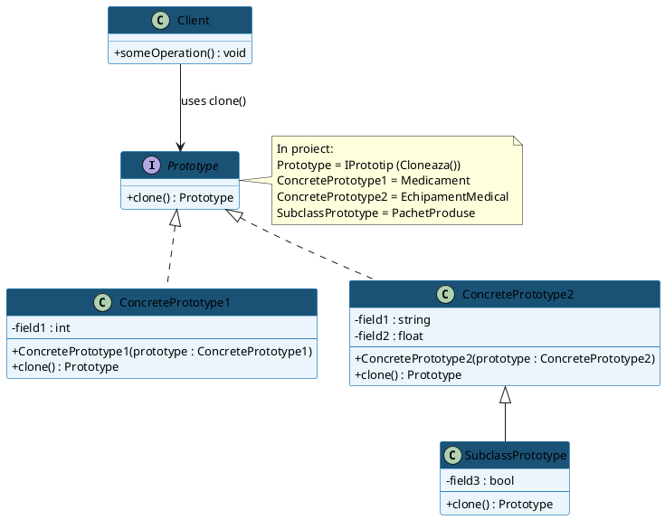

---

## 6. Adapter

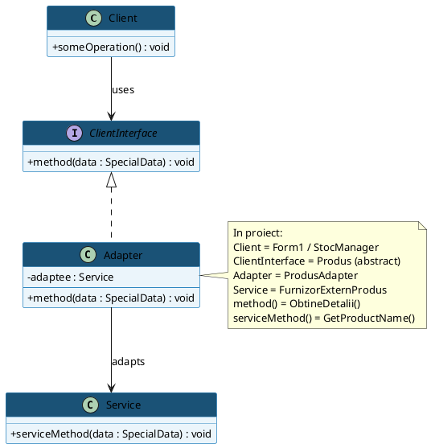

---

## 7. Bridge

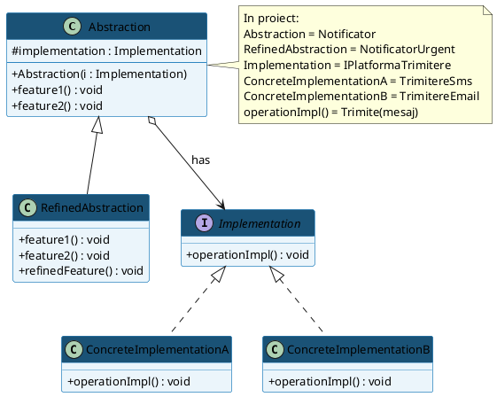

---

## 8. Composite

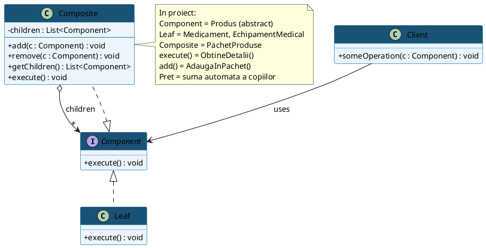

---

## 9. Decorator

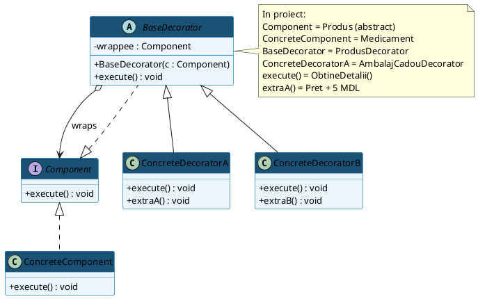

---

## 10. Facade

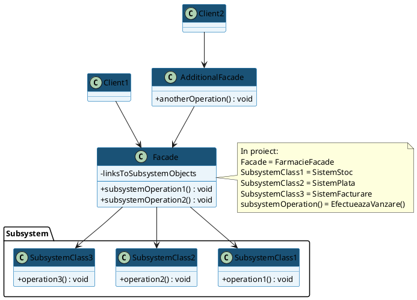

---

## 11. Flyweight

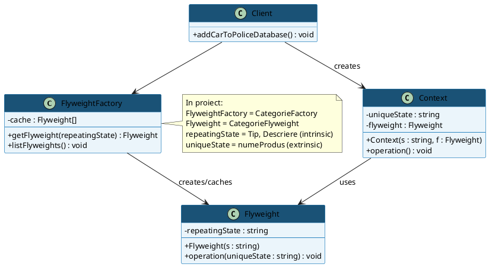

---

## 12. Proxy

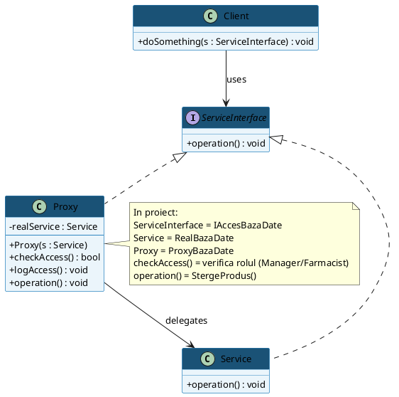

---

## 13. Chain of Responsibility

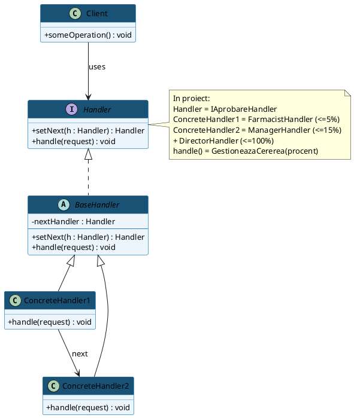

---

## 14. Command

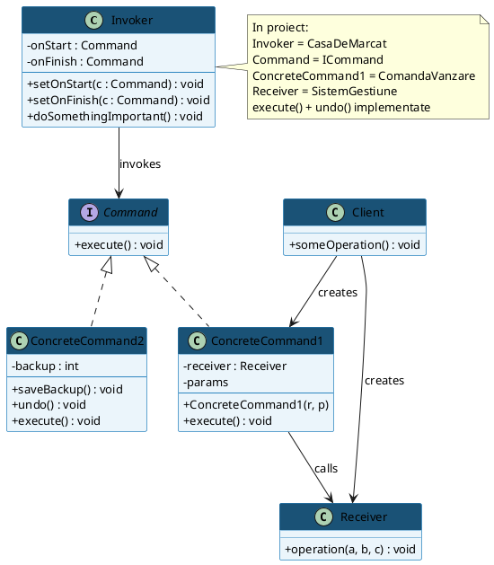

---

## 15. Iterator

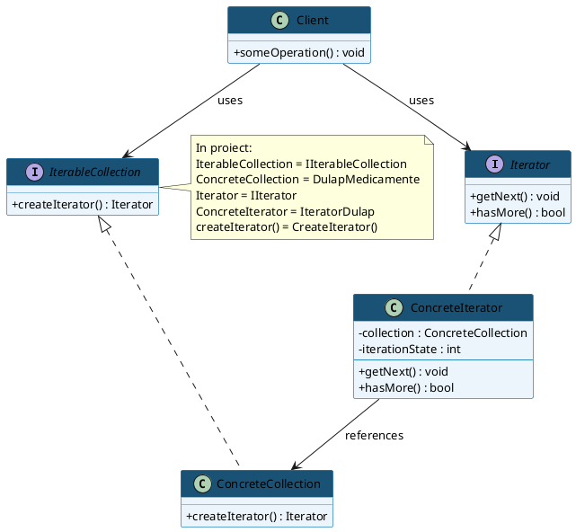

---

## 16. Mediator

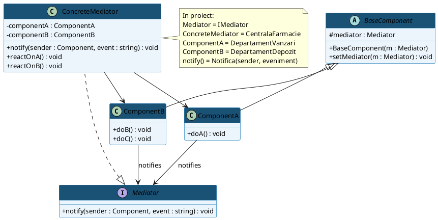

---

## 17. Memento

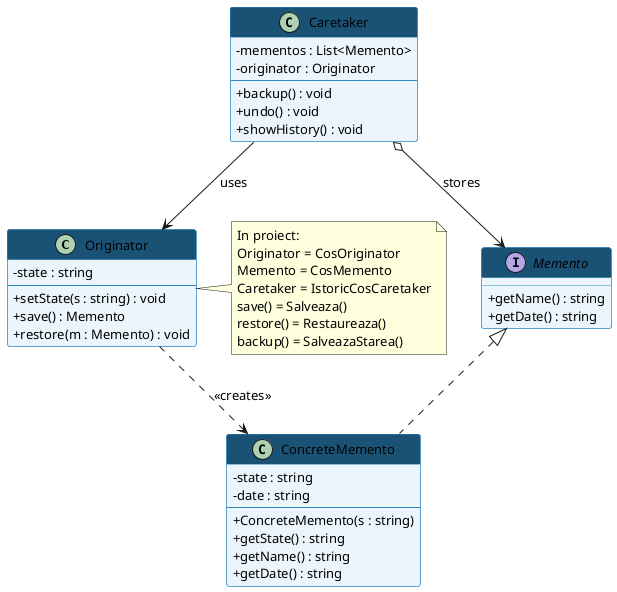

---

## 18. Observer

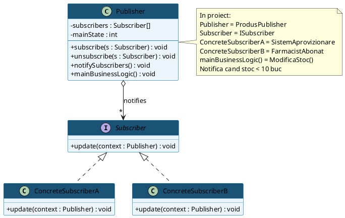

---

## 19. State

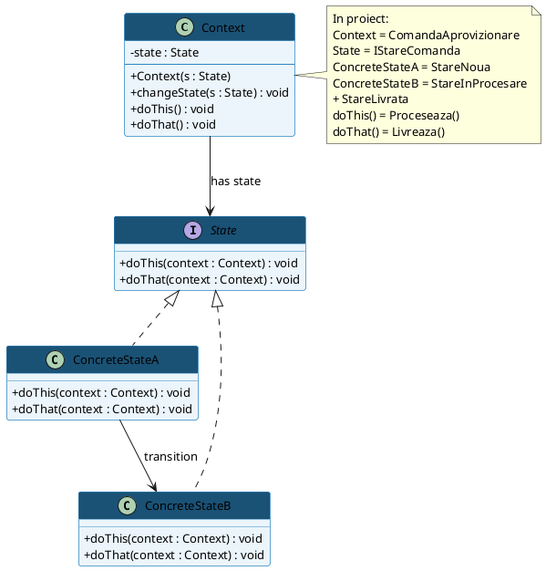

---

## 20. Strategy

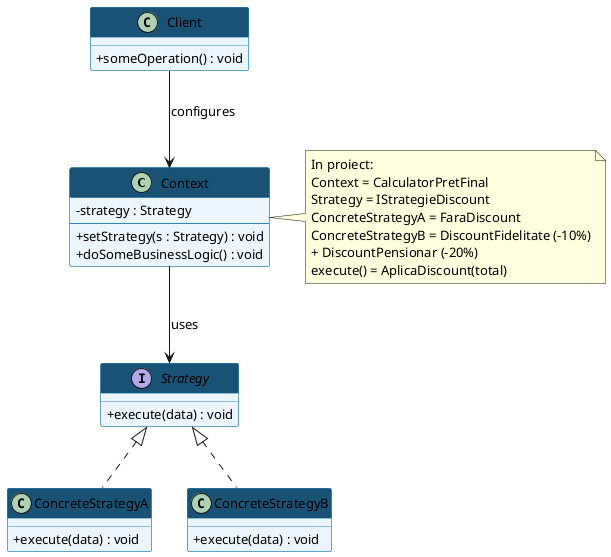

---

## 21. Template Method

```plantuml
@startuml TemplateMethod
skinparam classAttributeIconSize 0
skinparam defaultFontName Arial
skinparam defaultFontSize 13
skinparam class {
  BackgroundColor #EBF5FB
  BorderColor #2E86C1
  HeaderBackgroundColor #1A5276
  HeaderFontColor white
}

abstract class AbstractClass {
  + templateMethod() : void
  # step1() : void
  # {abstract} step2() : void
  # step3() : void
  # {abstract} step4() : void
}

class ConcreteClass1 {
  # step2() : void
  # step4() : void
}

class ConcreteClass2 {
  # step2() : void
  # step4() : void
}

AbstractClass <|-- ConcreteClass1
AbstractClass <|-- ConcreteClass2

note right of AbstractClass
  In proiect:
  AbstractClass = RaportTemplate
  templateMethod() = GenereazaRaport()
  step1() = CulegeDate() (comun)
  step2() = FormateazaRaport() (abstract)
  step3() = SalveazaFisier() (abstract)
  step4() = PrinteazaRaport() (comun)
  ConcreteClass1 = RaportZilnicVanzari (CSV)
  ConcreteClass2 = RaportStocCritic (TXT)
end note
@enduml
```

---

## 22. Visitor

```plantuml
@startuml Visitor
skinparam classAttributeIconSize 0
skinparam defaultFontName Arial
skinparam defaultFontSize 13
skinparam class {
  BackgroundColor #EBF5FB
  BorderColor #2E86C1
  HeaderBackgroundColor #1A5276
  HeaderFontColor white
}

interface Visitor {
  + visitConcreteComponentA(e : ConcreteComponentA) : void
  + visitConcreteComponentB(e : ConcreteComponentB) : void
}

class ConcreteVisitor1 {
  + visitConcreteComponentA(e : ConcreteComponentA) : void
  + visitConcreteComponentB(e : ConcreteComponentB) : void
}

class ConcreteVisitor2 {
  + visitConcreteComponentA(e : ConcreteComponentA) : void
  + visitConcreteComponentB(e : ConcreteComponentB) : void
}

interface Component {
  + accept(v : Visitor) : void
}

class ConcreteComponentA {
  + accept(v : Visitor) : void
  + exclusiveMethodOfConcreteComponentA() : void
}

class ConcreteComponentB {
  + accept(v : Visitor) : void
  + specialMethodOfConcreteComponentB() : void
}

class Client {
  + someOperation() : void
}

Visitor <|.. ConcreteVisitor1
Visitor <|.. ConcreteVisitor2
Component <|.. ConcreteComponentA
Component <|.. ConcreteComponentB
Client --> Visitor : uses
Client --> Component : uses
ConcreteVisitor1 ..> ConcreteComponentA : visits
ConcreteVisitor1 ..> ConcreteComponentB : visits

note right of Visitor
  In proiect:
  Visitor = IVisitorExport
  ConcreteVisitor1 = ExportXmlVisitor
  Component = IDocumentFarmacie
  ConcreteComponentA = RetetaCompensata
  ConcreteComponentB = FacturaFirma
  accept() -> v.Visit(this) = Double Dispatch
end note
@enduml
```
