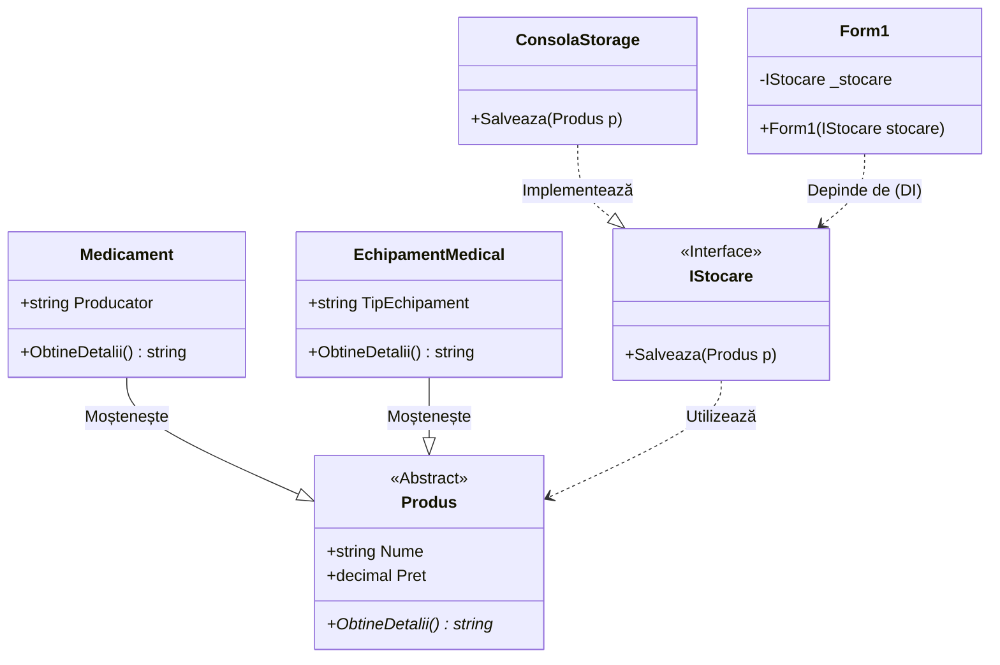

# Diagrama UML - Farmacie SOLID

Această diagramă ilustrează structura claselor și relațiile dintre ele (Moștenire, Implementare Interfață, Dependență).

```mermaid
classDiagram
    class Produs {
        <<Abstract>>
        +string Nume
        +decimal Pret
        +ObtineDetalii() string*
    }

    class Medicament {
        +string Producator
        +ObtineDetalii() string
    }

    class EchipamentMedical {
        +string TipEchipament
        +ObtineDetalii() string
    }

    class IStocare {
        <<Interface>>
        +Salveaza(Produs p)
    }

    class ConsolaStorage {
        +Salveaza(Produs p)
    }

    class Form1 {
        -IStocare _stocare
        +Form1(IStocare stocare)
    }

    %% Relații
    Medicament --|> Produs : Moștenește
    EchipamentMedical --|> Produs : Moștenește
    ConsolaStorage ..|> IStocare : Implementează
    Form1 ..> IStocare : Depinde de (DI)
    IStocare ..> Produs : Utilizează
```
